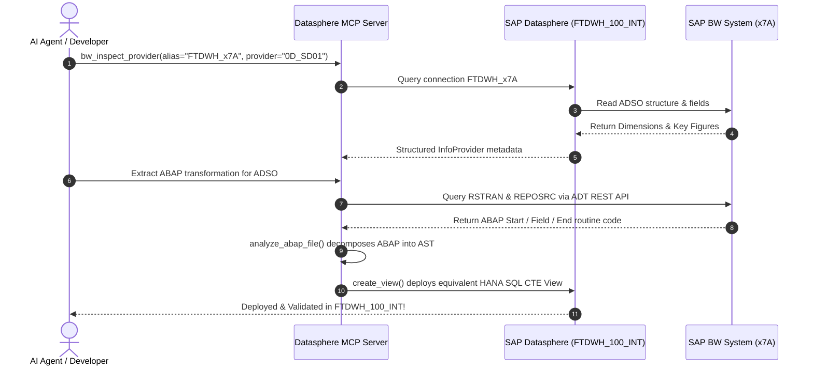

# SAP BW to Datasphere MCP Direct Connection Setup Guide

> **Target Audience**: SAP Datasphere Administrators, SAP BW Basis / Security Administrators, and MCP Integration Architects.  
> **Objective**: Enable direct, automated extraction of live data, InfoProviders, BEx query definitions, and ABAP transformation routine source code from **SAP BW (`x7A` / `K7A`)** into the **SAP Datasphere MCP Server**.

---

## 1. Executive Architecture Summary

Currently, **Live Data Extraction is already functioning** in Datasphere space `FTDWH_100_INT` via remote tables (connected to logical system `TD1_010_E`).

To enable **100% automated extraction** of InfoProviders, BEx Queries, and ABAP transformation routines (without requiring manual file copy-pasting or file uploads), the architecture uses a two-channel approach:

```mermaid
flowchart TD
    subgraph SAP BW / BW/4HANA (System x7A / K7A)
        T_RSTRAN["RSTRAN / REPOSRC<br/>(Transformation Routines)"]
        BEX["BEx Queries / InfoProviders<br/>(RSZ* / BAPI_IOBJ*)"]
        ACT_TAB["Active Tables / ADSOs<br/>(/BIC/A* / 1LR*)"]
        ADT_EP["ICF Service: /sap/bc/adt<br/>(ABAP REST API)"]
        GW_EP["SAP Gateway: /sap/opu/odata<br/>(BEx Easy Query)"]
    end

    subgraph SAP Datasphere (Space: FTDWH_100_INT)
        CONN_BW["Connection: FTDWH_x7A (Type: SAPBW)"]
        CONN_ABAP["Connection: FtDWH_x7A_ABAP (Type: ABAP)"]
        REM_TAB["Remote Tables / Replication Flows"]
    end

    subgraph SAP Datasphere MCP Server (AI Agent)
        MCP_DATA["Data & Schema Tools<br/>(get_table_schema, query_relational_entity)"]
        MCP_BW["BW Query Tools<br/>(bw_inspect_provider, bw_read_query)"]
        MCP_ABAP["ABAP Extraction & Conversion<br/>(analyze_abap_file, get_abap_conversion_guide)"]
    end

    ACT_TAB <-->|"RFC / DP-Agent"| CONN_BW
    CONN_BW --> REM_TAB
    REM_TAB <--> MCP_DATA

    BEX <-->|"RFC: RSZ_X_* / Easy Query"| CONN_BW
    CONN_BW <--> MCP_BW

    T_RSTRAN <-->|"HTTPS (ADT REST) or RFC (RFC_READ_TABLE)"| MCP_ABAP
```

---

## 2. Checklist for the SAP Datasphere Team

### 2.1 Connection Verification in Space `FTDWH_100_INT`
Verify that the following connections in space `FTDWH_100_INT` have valid credentials and pass the connection test:
1. **`FTDWH_x7A`** (Type: `SAPBW`): Used for browsing and importing InfoProviders, ADSOs, and BEx Queries.
2. **`FtDWH_x7A_ABAP`** (Type: `ABAP`): Used for reading ABAP CDS Views and DataSources.
3. **`K7A_HBD`** / **`K7A_HDB_CC`** (Type: `HANA`): Used for direct high-speed SQL access to the underlying HANA database of `x7A`.

### 2.2 Data Provisioning Agent (DP-Agent) Status
- Confirm that the **DP-Agent** registered for `daimlertruck-q.eu10.hcs.cloud.sap` is connected and active.
- Verify that the **ABAPAdapter** and **HanaAdapter** are enabled on the DP-Agent.

### 2.3 Datasphere App Integration / OAuth Scopes
Ensure the OAuth 2.0 Technical User / Client ID used by the MCP server (`DATASPHERE_CLIENT_ID`) has:
- Role: **`Space Administrator`** or **`Catalog Reader`** for space `FTDWH_100_INT`.
- Access Scopes: `openid`, `offline_access`, and Datasphere Consumption API access.

---

## 3. Checklist for the SAP BW Basis & Security Team (System `x7A` / `K7A`)

To allow the MCP Server and Datasphere to read BEx metadata and ABAP transformation routine code directly, configure the technical user (e.g. `MASREED` / Technical RFC User assigned to `FtDWH_x7A_ABAP`):

### 3.1 ICF Services to Activate (`SICF`)
Activate the following standard Internet Communication Framework (ICF) tree nodes:
- **`/default_host/sap/bc/adt`**  
  *Purpose*: Standard ABAP Development Tools (ADT) REST service. Allows reading program source code, transformation includes (`GP<GUID>`), and CDS view DDL definitions via HTTPS.
- **`/default_host/sap/opu/odata/sap/`**  
  *Purpose*: SAP Gateway OData foundation for BEx Easy Queries.
- **`/default_host/sap/bc/soap/rfc`**  
  *Purpose*: Standard RFC HTTP gateway.

### 3.2 RFC Authorizations (`PFCG` Role)
Grant the technical user a role containing authorization object **`S_RFC`**:
- `ACTVT`: `16` (Execute)
- `RFC_TYPE`: `FUGR` (Function Group)
- `RFC_NAME`:
  - `SRFC` (Connection ping and system inquiry)
  - `SDIS` (Standard table reader: `RFC_READ_TABLE`)
  - `RSZ_X` (BEx Query reader: `RSZ_X_COMPONENT_GET`, `RSZ_X_COMP_DIR_READ`)
  - `BAPI_IOBJ` (InfoObject inspection: `BAPI_IOBJ_GETDETAIL`)
  - `RSTRAN_RFC` (Transformation metadata reader, if BW/4HANA)

### 3.3 Table Display Authorizations (`S_TABU_DIS` / `S_TABU_NAM`)
To extract transformation routine logic automatically from the BW metadata dictionary:
- `ACTVT`: `03` (Display)
- Tables authorized in `S_TABU_NAM`:
  - **`RSTRAN`**: Transformation Header (maps Source ADSO to Target ADSO).
  - **`RSTRANSTEP`**: Rule execution steps (Direct assignment, Routine, Formula).
  - **`RSTRANRULE`** & **`RSTRANRULEFIELD`**: Field-to-field mapping rules.
  - **`REPOSRC`**: Contains the generated ABAP source code for routine includes (`GP<GUID>`).

---

## 4. MCP Server Configuration (`.env`)

Once the above authorizations are in place, configure the following variables in `.env`:

```env
# ==========================================
# SAP BW Direct Connection Configuration
# ==========================================
# Direct HTTPS endpoint to SAP BW system (for ADT REST and OData)
SAP_BW_HOST=https://<bw-system-host>:<port>
SAP_BW_CLIENT=100
SAP_BW_USER=<technical_rfc_user>
SAP_BW_PASSWORD=<technical_password>

# Space Connection alias already active in Datasphere
SAP_BW_CONNECTION_ALIAS=FTDWH_x7A
SAP_BW_ABAP_ALIAS=FtDWH_x7A_ABAP
```

---

## 5. End-to-End Extraction Workflow Once Configured


