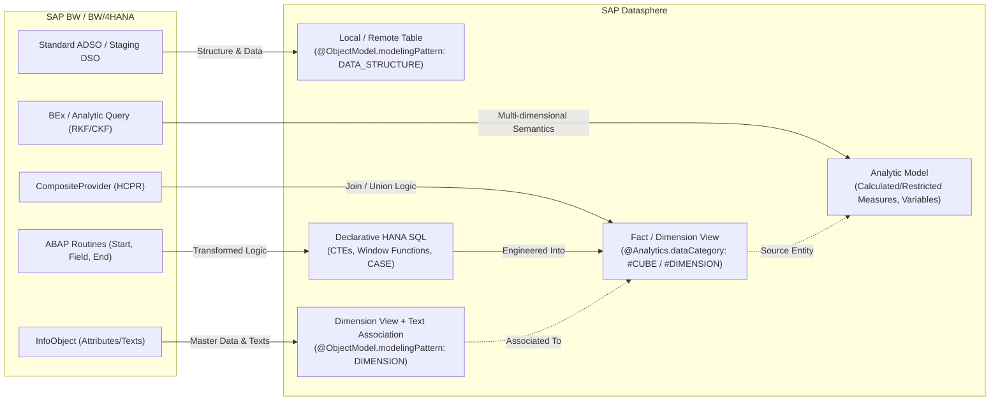
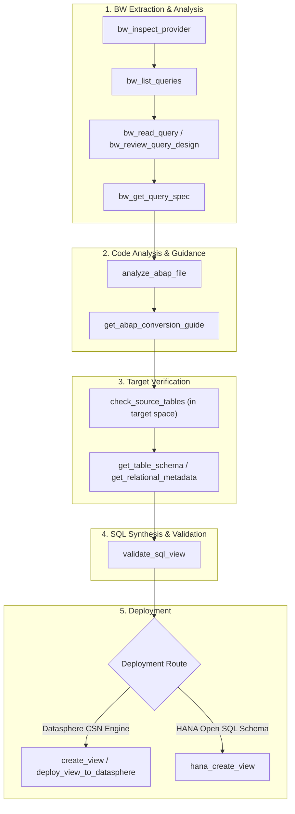

# SAP BW to Datasphere (BW2DSP) Migration Expert Guide

This skill provides autonomous AI agents and MCP clients with domain expertise to analyze, decompose, convert, and validate **SAP BW / BW/4HANA / BW Bridge artifacts** into **SAP Datasphere** native models (CSN entities, SQL views, and Analytic Models) and **SAP HANA Cloud SQL**.

---

## 1. BW to Datasphere Architectural & Logic Mapping

Migrating from SAP BW to SAP Datasphere is a transition from **procedural, row-by-row batch execution in an ABAP application server** to **declarative, set-based, in-memory execution in SAP HANA Cloud**.



### 1.1 InfoProvider Mapping Specifications

| SAP BW Artifact | SAP Datasphere Target | CSN `@ObjectModel.modelingPattern` | CSN `@Analytics.dataCategory` | Target Capability |
|---|---|---|---|---|
| **Standard ADSO** | Local Table / Remote Table | `{"#": "DATA_STRUCTURE"}` | N/A | Ingestion / Staging Layer |
| **Write-Optimized ADSO** | Local Table | `{"#": "DATA_STRUCTURE"}` | N/A | Raw Ingestion Layer |
| **Dimension InfoObject** | Dimension View | `{"#": "DIMENSION"}` | `{"#": "DIMENSION"}` | Master Data Layer |
| **InfoObject Texts** | Text View (with `@Semantics.language`) | `{"#": "DIMENSION"}` | `{"#": "DIMENSION"}` | Multi-language Descriptions |
| **CompositeProvider (Union)** | SQL View with `UNION ALL` | `{"#": "FACT"}` | `{"#": "CUBE"}` | Semantic Data Layer |
| **CompositeProvider (Join)** | SQL View with `INNER` / `LEFT JOIN` | `{"#": "FACT"}` | `{"#": "CUBE"}` | Semantic Data Layer |
| **BEx Query (Formulas/RKFs)** | Analytic Model | Consumes Fact View | N/A | Reporting & SAC Consumption |

---

## 2. ABAP Transformation Routine Translation Rules

### 2.1 Start Routine (Pre-Filtering & Data Preparation)
* **ABAP Paradigm**: Modifies `SOURCE_PACKAGE` by deleting records (`DELETE SOURCE_PACKAGE WHERE ...`) or filling internal lookup tables (`SELECT ... INTO TABLE lt_buffer FOR ALL ENTRIES IN SOURCE_PACKAGE`).
* **Datasphere Target**: Base projection filter (`WHERE`) or first Common Table Expression (CTE) stage.
* **Conversion Pattern**:
  ```sql
  WITH start_routine_filter AS (
      SELECT *
      FROM "FTDWH_100_INT"."1LR_VBAP_01"
      WHERE (fksto IS NULL OR fksto != 'X') -- Negate deletion criteria
        AND vbtyp = 'C'
  )
  ```

### 2.2 Field Routine (Calculations, String, and Date Formatting)
* **ABAP Paradigm**: Computes a single field value stored in `RESULT`.
* **Datasphere Target**: Scalar expressions and built-in HANA SQL functions in the projection list.
* **Core Conversion Map**:
  - `CALL FUNCTION 'CONVERSION_EXIT_ALPHA_INPUT'` $\rightarrow$ `LPAD(LTRIM("FIELD", ' '), 10, '0')`
  - `CALL FUNCTION 'CONVERSION_EXIT_ALPHA_OUTPUT'` $\rightarrow$ `LTRIM("FIELD", '0')`
  - String slicing `lv_val+0(4)` $\rightarrow$ `SUBSTRING("FIELD", 1, 4)`
  - Concatenation `CONCATENATE a b INTO c` $\rightarrow$ `CONCAT("FIELD_A", "FIELD_B")` or `"FIELD_A" || "FIELD_B"`
  - Current Date `sy-datum` $\rightarrow$ `CURRENT_UTCDATE`
  - Date addition `lv_date + 30` $\rightarrow$ `ADD_DAYS("DATE_FIELD", 30)`
  - Month extraction `lv_date+4(2)` $\rightarrow$ `SUBSTRING("DATE_FIELD", 5, 2)`
  - Conditional checks $\rightarrow$ `CASE WHEN condition THEN val1 ELSE val2 END`
  - Initial/Null checks $\rightarrow$ `COALESCE("FIELD", 'DEFAULT')`

### 2.3 Lookup Routine (Internal Table `READ TABLE ... WITH KEY`)
* **ABAP Paradigm**: `READ TABLE lt_lookup INTO ls_lookup WITH KEY k1 = ... BINARY SEARCH`.
* **Datasphere Target**: `LEFT OUTER JOIN` against the lookup table or view.
* **Conversion Pattern**:
  ```sql
  SELECT 
      ord.vbeln,
      ord.kunnr,
      COALESCE(cust.land1, 'XX') AS "CUSTOMER_COUNTRY"
  FROM start_routine_filter AS ord
  LEFT OUTER JOIN "FTDWH_100_INT"."DIM_CUSTOMER" AS cust
      ON ord.kunnr = cust.kunnr
  ```

### 2.4 End Routine & Expert Routine (Deduplication, Windowing, Aggregates)
* **ABAP Paradigm**: Operates on `RESULT_PACKAGE` after all field transformations (e.g. `SORT ... BY ... DELETE ADJACENT DUPLICATES COMPARING ...`).
* **Datasphere Target**: Window functions (`ROW_NUMBER() OVER (...)`, `RANK()`, `SUM() OVER (...)`).
* **Conversion Pattern**:
  ```sql
  WITH ranked_records AS (
      SELECT 
          vbeln,
          posnr,
          aedat,
          netwr,
          ROW_NUMBER() OVER (
              PARTITION BY vbeln 
              ORDER BY aedat DESC
          ) AS rn
      FROM transformed_data
  )
  SELECT vbeln, posnr, aedat, netwr
  FROM ranked_records
  WHERE rn = 1;
  ```

---

## 3. Real-World Community Edge Cases & Migration Pitfalls

During real-world migrations, practitioners encounter subtle discrepancies between the ABAP application layer and SAP HANA Cloud. Autonomous agents must systematically check for and mitigate the following edge cases:

### Edge Case 1: The 1:N Lookup Row Explosion (Cartesian Inflation)
* **Problem**: In ABAP, `READ TABLE lt_itab WITH KEY ...` always returns only the **first matching record**, silently discarding any subsequent duplicates in the lookup table. When translated directly to a naive SQL `LEFT OUTER JOIN`, if the lookup table has duplicate keys, the join produces multiple rows per fact record, multiplying row counts and inflating metrics!
* **Remediation**: Always enforce uniqueness on the lookup side using a CTE with `ROW_NUMBER() OVER (PARTITION BY join_keys ORDER BY priority_col)` filtering for `rn = 1` before joining.

### Edge Case 2: Time-Dependent Master Data Lookups (`DATEFROM` / `DATETO`)
* **Problem**: In SAP BW, master data lookups evaluate time dependency against a reference posting date (`PSTDAT BETWEEN DATEFROM AND DATETO`). In ABAP, missing master data might fall back to `sy-datum` or unconstrained records.
* **Remediation**:
  ```sql
  LEFT OUTER JOIN "FTDWH_100_INT"."DIM_EMPLOYEE" AS emp
      ON fact.emp_id = emp.emp_id
     AND fact.posting_date BETWEEN emp.valid_from AND emp.valid_to
  ```
  Handle unbounded dates (`99991231` or `00000000`) using:
  `COALESCE(emp.valid_to, '99991231')`.

### Edge Case 3: Compounding InfoObjects (Missing Parent Keys)
* **Problem**: In SAP BW, InfoObjects often have compounding parents (e.g., `0COSTCENTER` is compounded to `0CO_AREA`; `0MATERIAL` is compounded to `0LOGSYS`). In ABAP, the system implicitly manages compounding. In Datasphere SQL views, joining only on `COSTCENTER` causes a cross-product across Controlling Areas!
* **Remediation**: Every join on a compounded InfoObject must join **both the parent key and child key**:
  ```sql
  ON fact.kokrs = dim.co_area AND fact.kostl = dim.cost_center
  ```

### Edge Case 4: Currency & Unit Conversion Differences
* **Problem**: 
  1. **Decimals in `TCURX`**: Certain currencies (JPY, KRW, HUF) have 0 or 3 decimals. SAP ERP stores 100 JPY as `1.00` in the database, expecting the ABAP layer to divide/multiply by 100 based on `TCURX`. Direct SQL reads will misrepresent amounts by a factor of 100!
  2. **Indirect Quotation (`TCURF`)**: Inverting exchange rates.
* **Remediation**: Do not write custom mathematical division for currencies in raw SQL. Use **Datasphere Currency Conversion Nodes** in Graphical Views or Analytic Models, which automatically respect SAP `TCURX`, `TCURR`, and `TCURF` tables.

### Edge Case 5: Delta & Inverted Record Handling (`0RECORDMODE`)
* **Problem**: In Standard ADSOs, changelog tables record delta images:
  - ` ` (After Image): New or updated value.
  - `X` (Before Image): Negated previous value.
  - `R` (Reverse Image): Cancellation.
  - `D` (Delete Image): Deletion.
  In ABAP transformations, the BW runtime handles delta aggregation. In a Datasphere SQL view, selecting directly from the changelog without handling `0RECORDMODE` corrupts aggregates!
* **Remediation**: Read from the **Active Table** (`/BIC/A...2`) instead of the changelog whenever possible. If reading changelog records, implement sign inversion:
  ```sql
  CASE 
      WHEN recordmode = 'X' OR recordmode = 'R' THEN -1 * amount 
      ELSE amount 
  END AS signed_amount
  ```

### Edge Case 6: Time Zone Discrepancy (`sy-datum` vs HANA UTC)
* **Problem**: ABAP `sy-datum` reflects the SAP Application Server time zone (e.g., CET/CEST), whereas SAP HANA Cloud runs on UTC (`CURRENT_UTCDATE`). Queries around midnight can shift posting dates by $\pm 1$ day.
* **Remediation**: Use `UTCTOLOCAL(CURRENT_UTCTIMESTAMP, 'CET')` when localized business date evaluation is required.

### Edge Case 7: BEx Exception Aggregation (Last Value / Distinct Count)
* **Problem**: BEx queries heavily utilize Exception Aggregations (e.g., Inventory Stock using "Last Value" across Fiscal Period, or Customer Count using "Distinct Count"). Standard SQL views only support simple `SUM`, `MIN`, `MAX`.
* **Remediation**:
  - Model base measures in the Datasphere Fact View.
  - Apply **Exception Aggregation** in the **Datasphere Analytic Model**, specifying the Exception Dimension (e.g. `Time`) and Aggregation Type (`Last Value` / `Count Distinct`).

### Edge Case 8: BEx Customer Exit Variables (`I_STEP 1, 2, 3`)
* **Problem**: In BEx, variables with Customer Exit (`I_STEP = 1` before prompt, `I_STEP = 2` after prompt validation) execute ABAP code (e.g. calculating Current Year - 1).
* **Remediation**:
  - In Datasphere Analytic Models, use **Input Parameters** combined with **Calculated Measures**.
  - For dynamic period offsets (e.g. Rolling 12 Months), implement dynamic date filtering in an underlying SQL View using HANA SQL date functions (`ADD_MONTHS`, `LAST_DAY`).

---

## 4. Migration MCP Tool Map & Execution Workflow

The following step-by-step workflow maps which MCP tool to invoke at each phase of the BW-to-Datasphere migration:



### Detailed Tool Mapping Table

| Migration Phase | MCP Tool Name | Purpose & Trigger | Key Inputs | Expected Output |
|---|---|---|---|---|
| **1. Source Introspection** | `bw_inspect_provider` | Call first to analyze BW InfoProvider structure (ADSO, CompositeProvider). | `alias: "BW_PROD"`, `technicalName: "2CC..."`, `project` | Key figures, dimensions, navigation attributes, InfoObjects |
| **1. Source Introspection** | `bw_list_queries` | Discover BEx / Analytic Queries built on the InfoProvider. | `alias: "BW_PROD"`, `providerName: "..."` | List of query technical names and descriptions |
| **1. Source Introspection** | `bw_read_query` | Retrieve full XML / JSON query definition from BW. | `alias: "BW_PROD"`, `queryName: "..."` | Raw query definition, filters, free characteristics |
| **1. Source Introspection** | `bw_review_query_design` | High-level architectural review of query complexity and components. | `alias: "BW_PROD"`, `queryName: "..."` | Design summary, complexity rating, migration feasibility |
| **1. Source Introspection** | `bw_get_query_spec` | Extract structured specification of CKFs, RKFs, variables, and formulas. | `alias: "BW_PROD"`, `queryName: "..."` | Formulas, restricted key figures, variable definitions |
| **2. Code Analysis** | `analyze_abap_file` | Parse ABAP transformation routines (Start, Field, End, Expert). | `filePath: "..."` or code payload | AST of ABAP code, internal tables, loops, selects |
| **2. Code Analysis** | `get_abap_conversion_guide` | Retrieve targeted transformation advice for detected ABAP constructs. | `abap_construct: "READ_TABLE"` | SQL pattern recommendations and best practices |
| **3. Target Verification** | `check_source_tables` | Verify that replicated ERP/S4/BW source tables exist and are active in Datasphere space. | `space_id: "FTDWH_100_INT"`, `source_tables: ["1LR_VBAP_01", "1LR_VBAK_01"]` | Verification status: exists, active, missing |
| **3. Target Verification** | `get_table_schema` | Confirm exact field names and types of verified source tables in Datasphere. | `space_id: "FTDWH_100_INT"`, `table_name: "1LR_VBAP_01"` | Column names, CDS data types, nullability |
| **4. Validation** | `validate_sql_view` | **MANDATORY before deployment**: Checks syntax, ensures referenced tables exist, and verifies zero destructive commands. | `space_id: "FTDWH_100_INT"`, `sql_query: "..."` | `{ valid: true, referencedTables: [...] }` |
| **5. Deployment** | `deploy_view_to_datasphere` or `create_view` | Deploy verified CSN Fact/Dimension View into Datasphere catalog via CLI. | `space_id: "FTDWH_100_INT"`, `view_name: "V_FACT_SALES"`, `sql_definition` | Deployed Datasphere CSN view object |
| **5. Deployment** | `hana_create_view` | Deploy verified SQL View directly into the HANA Open SQL Schema (`DSP_OPEN_SCHEME`). | `view_name: "V_FACT_SALES"`, `select_query: "..."` | Deployed HANA Column View in `DSP_OPEN_SCHEME` |

---

### 4.1 When to Choose CSN View vs. HANA SQL View in BW2DSP Migrations

| Migration Objective | Recommended Route | Primary MCP Tool | Rationale & Trade-offs |
|---|---|---|---|
| **CompositeProvider (HCPR) Migration** | **CSN Approach** | `create_view` / `deploy_view_to_datasphere` | Must be visible in Datasphere Graphical View Builder and serve as a source for Analytic Models and SAP Analytics Cloud (SAC) stories. Requires `@ObjectModel.modelingPattern: { "#": "FACT" }` and `@Analytics.dataCategory: { "#": "CUBE" }`. |
| **Dimension InfoObject Migration** | **CSN Approach** | `create_view` (as `#DIMENSION`) | Master data views require Text Associations (`@Semantics.language`) and Dimension attributes for Star Schema joins. |
| **Complex ABAP Expert / End Routine** | **HANA SQL Approach** | `hana_create_view` | When ABAP routines contain complex multi-pass loops, ranking, sliding window partitions, or string regex that exceed standard Datasphere Graphical View SQL limits, deploy directly to `DSP_OPEN_SCHEME`. |
| **High-Speed Staging / Raw ADSO Ingestion** | **HANA SQL Approach** | `hana_create_table` / `hana_execute_sql` | Direct column tables in `DSP_OPEN_SCHEME` support high-throughput bulk loads via ODBC/JDBC (Python, Spark, Kafka) without Datasphere catalog compilation overhead. |
| **Third-Party Reporting (Power BI / Tableau)** | **HANA SQL Approach** | `hana_create_view` | External BI tools querying SAP HANA Cloud port 443 via ODBC connect directly to `DSP_OPEN_SCHEME`. |
| **Enterprise Best Practice (Hybrid Bridge)** | **Hybrid** | `hana_create_view` + `create_view` | Build complex transformation/deduplication in `DSP_OPEN_SCHEME` via `hana_create_view`, then expose a lightweight semantic CSN View via `create_view` for SAC. |


---

## 5. End-to-End Migration Code Conversion Example

### Legacy ABAP Transformation Routine
```abap
* Start Routine: Filter deleted documents & prepare buffer
METHOD start_routine.
  DELETE SOURCE_PACKAGE WHERE loevm = 'X'.
  SELECT matnr, matkl, spart FROM mara
    INTO TABLE @DATA(lt_mara)
    FOR ALL ENTRIES IN @SOURCE_PACKAGE
    WHERE matnr = @SOURCE_PACKAGE-matnr.
  SORT lt_mara BY matnr.
ENDMETHOD.

* Field Routine: Strip zero padding & format document
METHOD field_routine_doc.
  RESULT = LTRIM( SOURCE_FIELDS-vbeln, '0' ).
ENDMETHOD.

* End Routine: Lookup Material Group and Division, calculate Tax
METHOD end_routine.
  LOOP AT RESULT_PACKAGE ASSIGNING FIELD-SYMBOL(<rec>).
    READ TABLE lt_mara INTO DATA(ls_mara)
         WITH KEY matnr = <rec>-matnr BINARY SEARCH.
    IF sy-subrc = 0.
      <rec>-matkl = ls_mara-matkl.
      <rec>-spart = ls_mara-spart.
    ELSE.
      <rec>-matkl = 'UNKNOWN'.
      <rec>-spart = '00'.
    ENDIF.

    " Calculate estimated tax
    <rec>-tax_amount = <rec>-net_amount * '0.19'.
  ENDLOOP.
ENDMETHOD.
```

### Pushed-Down SAP HANA Cloud SQL Transformation (Production-Ready)
```sql
WITH filtered_source AS (
    -- Start Routine: Filter deleted items
    SELECT 
        vbeln,
        posnr,
        matnr,
        netwr AS net_amount,
        waerk AS currency_code,
        aedat AS change_date
    FROM "FTDWH_100_INT"."1LR_VBAP_01"
    WHERE (loevm IS NULL OR loevm != 'X')
),

deduplicated_lookup AS (
    -- Edge Case 1 Mitigation: Deduplicate master data lookup to prevent Cartesian row explosion
    SELECT 
        matnr,
        matkl,
        spart,
        ROW_NUMBER() OVER (PARTITION BY matnr ORDER BY aedat DESC) AS rn
    FROM "FTDWH_100_INT"."1LR_MARA_01"
),

transformed_dataset AS (
    -- Field Routine & End Routine: Scalar transforms, safe lookup, and tax calculation
    SELECT 
        LTRIM(src.vbeln, '0')                     AS "SALES_DOC_CLEAN",
        src.posnr                                  AS "ITEM_NUM",
        src.matnr                                  AS "MATERIAL_ID",
        COALESCE(lkp.matkl, 'UNKNOWN')            AS "MATERIAL_GROUP",
        COALESCE(lkp.spart, '00')                 AS "DIVISION",
        src.net_amount                             AS "NET_AMOUNT",
        CAST(src.net_amount * 0.19 AS DECIMAL(15,2)) AS "TAX_AMOUNT",
        src.currency_code                          AS "CURRENCY_CODE",
        src.change_date                            AS "CHANGE_DATE"
    FROM filtered_source AS src
    LEFT OUTER JOIN deduplicated_lookup AS lkp
        ON src.matnr = lkp.matnr
       AND lkp.rn = 1
)

SELECT * FROM transformed_dataset;
```

---

## 6. Comprehensive References
For detailed deep dives into specific CSN modeling schemas, full ABAP transformation routine ASTs, standard SAP tables, and further case studies, see:
* [BW to Datasphere ABAP Migration Handbook](file:///C:/Users/kpjee/.gemini/antigravity/scratch/sap-datasphere-mcp/skills/bw2dsp-migration-expert/references/bw2dsp-abap-migration.md)
* [SAP Standard Tables, Business Logic & Official Documentation Reference](file:///C:/Users/kpjee/.gemini/antigravity/scratch/sap-datasphere-mcp/skills/bw2dsp-migration-expert/references/sap-standard-tables-business-reference.md)
* [SAP BW to Datasphere Direct Connection Setup Guide](file:///C:/Users/kpjee/.gemini/antigravity/scratch/sap-datasphere-mcp/docs/SAP_BW_DIRECT_CONNECTION_SETUP_GUIDE.md)


