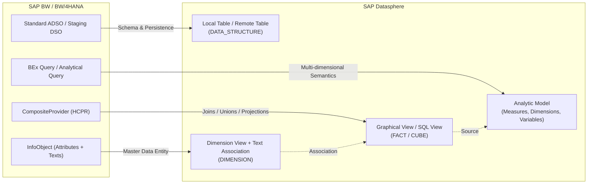

# SAP BW / BW/4HANA to SAP Datasphere Migration Handbook
## From ABAP Procedural Routines to CSN Modeling & SAP HANA Cloud SQL

---

## 1. Architectural Paradigm Shift: BW to SAP Datasphere

Migrating from SAP Business Warehouse (BW 7.x, BW/4HANA, BW Bridge) to SAP Datasphere requires a shift from **procedural, row-by-row batch processing** in an ABAP application server to **declarative, push-down, set-based processing** in SAP HANA Cloud and Core Schema Notation (CSN) modeling.

### Core Architectural Comparison

| Feature / Dimension | SAP BW / BW/4HANA | SAP Datasphere |
|---|---|---|
| **Execution Engine** | ABAP Application Server (`SOURCE_PACKAGE`, `RESULT_PACKAGE`) | In-Memory SAP HANA Cloud Engine (Pushed down SQL / Calculation Engine) |
| **Data Definition** | ABAP Dictionary (`DDIC`), InfoObjects, ADSO structures | Core Schema Notation (CSN / JSON-based CDS schema) |
| **Data Staging** | Standard ADSO, Write-Optimized ADSO, InfoCubes | Local Tables (`DATA_STRUCTURE`), Remote Tables |
| **Virtual Union / Join** | CompositeProvider (`HCPR`), MultiProvider | Graphical Views / SQL Views (`FACT`, `DIMENSION`) |
| **Semantic & Reporting Layer** | BEx Query / Analytic Query (`RSRT`, CKFs, RKFs) | Analytic Model (Dimensions, Measures, Variables, Currency Conversion) |
| **Transformation Logic** | ABAP Routines (Start, Field, End, Expert) | Declarative HANA SQL (CTEs, Window Functions, `CASE`, Lookups) or Data Flows |
| **Business User Consumption** | SAP Analysis for Office, SAC via BICS | SAP Analytics Cloud (SAC via OData / HANA Cloud), Power BI / Excel via Open SQL Schema |

---

## 2. InfoProvider to Datasphere Artifact Mapping Matrix



### 2.1 Mapping Table

| SAP BW Artifact | SAP Datasphere Artifact | CSN Modeling Pattern (`@ObjectModel.modelingPattern`) | Semantic Capabilities (`@ObjectModel.supportedCapabilities`) |
|---|---|---|---|
| **Standard ADSO (Reporting)** | Local Table / Remote Table | `{"#": "DATA_STRUCTURE"}` | `[{"#": "DATA_STRUCTURE"}]` |
| **Write-Optimized ADSO** | Ingestion Local Table | `{"#": "DATA_STRUCTURE"}` | `[{"#": "DATA_STRUCTURE"}]` |
| **Dimension InfoObject** | Dimension View | `{"#": "DIMENSION"}` | `[{"#": "DIMENSION"}, {"#": "SQL_DATA_ACCESS"}]` |
| **InfoObject Texts** | Text View (with `@Semantics.language`) | `{"#": "DIMENSION"}` | `[{"#": "DIMENSION"}]` |
| **CompositeProvider (Union)** | SQL View / Graphical View with `UNION ALL` | `{"#": "FACT"}` | `[{"#": "FACT"}, {"#": "DATA_STRUCTURE"}]` |
| **CompositeProvider (Join)** | SQL View with `INNER` / `LEFT JOIN` | `{"#": "FACT"}` | `[{"#": "FACT"}, {"#": "DATA_STRUCTURE"}]` |
| **BEx Query (Formulas/RKFs)** | Analytic Model | Consumes Fact View | Calculated Measures, Restricted Measures, Input Variables |

---

## 3. ABAP Transformation Routine Conversion Guide

In SAP BW, transformation rules contain four primary ABAP exit points:
1. **Start Routine**: Pre-filters or enriches the internal table `SOURCE_PACKAGE`.
2. **Field Routine**: Computes or formats a single target field (`RESULT = ...`).
3. **End Routine**: Modifies, aggregates, or deduplicates `RESULT_PACKAGE` after standard rules.
4. **Expert Routine**: Replaces the entire transformation pipeline with custom ABAP.

### 3.1 Start Routine Translation
* **ABAP Behavior**: Evaluates rows in `SOURCE_PACKAGE`, deletes invalid records (`DELETE SOURCE_PACKAGE WHERE ...`), or populates memory buffers.
* **Datasphere Translation**: 
  - Expressed as a **SQL `WHERE` clause** in the base projection or in a Common Table Expression (CTE).
  - In Graphical Views: Represented as a **Filter Node**.

#### ABAP Example:
```abap
METHOD start_routine.
  " Delete cancelled sales documents and non-sales order categories
  DELETE SOURCE_PACKAGE WHERE fksto = 'X' 
                           OR vbtyp <> 'C'.
ENDMETHOD.
```

#### Datasphere SQL Equivalent:
```sql
WITH filtered_source AS (
    SELECT 
        vbeln,
        posnr,
        fksto,
        vbtyp,
        netwr,
        waerk
    FROM "FTDWH_100_INT"."1LR_VBAP_01"
    WHERE (fksto IS NULL OR fksto != 'X')
      AND vbtyp = 'C'
)
SELECT * FROM filtered_source;
```

---

### 3.2 Field Routine Translation
* **ABAP Behavior**: Computes one field using character string manipulation, date parsing, or conditional logic.
* **Datasphere Translation**: Standard SAP HANA SQL scalar expressions, `CASE` statements, and conversion functions.

| ABAP Function / Operation | SAP HANA Cloud SQL Equivalent |
|---|---|
| `CALL FUNCTION 'CONVERSION_EXIT_ALPHA_INPUT'` | `LPAD(LTRIM("FIELD", ' '), 10, '0')` |
| `CALL FUNCTION 'CONVERSION_EXIT_ALPHA_OUTPUT'`| `LTRIM("FIELD", '0')` |
| String slicing `lv_val+0(4)` | `SUBSTRING("FIELD", 1, 4)` |
| Concatenation `CONCATENATE a b INTO c` | `CONCAT("FIELD_A", "FIELD_B")` or `"FIELD_A" \|\| "FIELD_B"` |
| Current Date `sy-datum` | `CURRENT_UTCDATE` or `CURRENT_DATE` |
| Date addition `lv_date + 30` | `ADD_DAYS("DATE_FIELD", 30)` |
| Month extraction `lv_date+4(2)` | `SUBSTRING("DATE_FIELD", 5, 2)` or `EXTRACT(MONTH FROM "DATE_FIELD")` |
| `IF ... ELSEIF ... ELSE` | `CASE WHEN condition THEN val1 ELSE val2 END` |
| Fallback / Null coalescing `IF val IS INITIAL` | `COALESCE("FIELD", 'DEFAULT')` |

#### ABAP Example:
```abap
METHOD compute_fiscal_period.
  " Input: BUDAT (YYYYMMDD)
  " Output: FISCPER (YYYY0PP)
  DATA: lv_year(4) TYPE c,
        lv_month(2) TYPE c.
  
  lv_year = SOURCE_FIELDS-budat+0(4).
  lv_month = SOURCE_FIELDS-budat+4(2).
  
  IF lv_month BETWEEN '01' AND '03'.
    CONCATENATE lv_year '001' INTO RESULT.
  ELSEIF lv_month BETWEEN '04' AND '06'.
    CONCATENATE lv_year '002' INTO RESULT.
  ELSE.
    CONCATENATE lv_year '003' INTO RESULT.
  ENDIF.
ENDMETHOD.
```

#### Datasphere SQL Equivalent:
```sql
CASE 
    WHEN SUBSTRING("BUDAT", 5, 2) BETWEEN '01' AND '03' 
        THEN CONCAT(SUBSTRING("BUDAT", 1, 4), '001')
    WHEN SUBSTRING("BUDAT", 5, 2) BETWEEN '04' AND '06' 
        THEN CONCAT(SUBSTRING("BUDAT", 1, 4), '002')
    ELSE CONCAT(SUBSTRING("BUDAT", 1, 4), '003')
END AS "FISCPER"
```

---

### 3.3 Lookup Routine Translation
* **ABAP Behavior**: Internal tables populated via `SELECT ... FROM /BIC/A... INTO TABLE lt_lookup` followed by `READ TABLE lt_lookup WITH KEY ... BINARY SEARCH`.
* **Datasphere Translation**: 
  - Expressed directly as an **SQL `LEFT OUTER JOIN`** with the lookup table or view.
  - Expressed semantically in CSN as an **Association** between the Fact View and the Dimension View.

#### ABAP Example:
```abap
METHOD field_routine_cust_country.
  " Lookup Customer Country from KNA1
  READ TABLE gt_kna1 INTO gs_kna1 
       WITH KEY kunnr = SOURCE_FIELDS-kunnr 
       BINARY SEARCH.
  IF sy-subrc = 0.
    RESULT = gs_kna1-land1.
  ELSE.
    RESULT = 'XX'.
  ENDIF.
ENDMETHOD.
```

#### Datasphere SQL Equivalent:
```sql
SELECT 
    ord.vbeln,
    ord.kunnr,
    COALESCE(cust.land1, 'XX') AS "CUSTOMER_COUNTRY"
FROM "FTDWH_100_INT"."1LR_VBAK_01" AS ord
LEFT OUTER JOIN "FTDWH_100_INT"."DIM_CUSTOMER" AS cust
    ON ord.kunnr = cust.kunnr;
```

---

### 3.4 End Routine Translation (Deduplication & Window Functions)
* **ABAP Behavior**: Operates on the full `RESULT_PACKAGE` after all field transformations. Often used for:
  - Deduplication: `SORT ... BY ... DELETE ADJACENT DUPLICATES COMPARING ...`
  - Finding the latest status / latest timestamp: `LOOP AT ... SORT ...`.
  - Running totals or ratio of totals: calculating percentages against total group volume.
* **Datasphere Translation**:
  - SAP HANA SQL **Window Functions**: `ROW_NUMBER() OVER (PARTITION BY ... ORDER BY ...)`
  - Window Aggregates: `SUM(amount) OVER (PARTITION BY group_col)`

#### ABAP Example (Keeping the Latest Status per Order):
```abap
METHOD end_routine.
  " Sort by Order ID and Change Date descending, then keep top record
  SORT RESULT_PACKAGE BY vbeln ASCENDING aedat DESCENDING.
  DELETE ADJACENT DUPLICATES FROM RESULT_PACKAGE COMPARING vbeln.
ENDMETHOD.
```

#### Datasphere SQL Equivalent:
```sql
WITH ranked_orders AS (
    SELECT 
        vbeln,
        posnr,
        aedat,
        netwr,
        ROW_NUMBER() OVER (
            PARTITION BY vbeln 
            ORDER BY aedat DESC
        ) AS rn
    FROM "FTDWH_100_INT"."1LR_VBAP_01"
)
SELECT 
    vbeln,
    posnr,
    aedat,
    netwr
FROM ranked_orders
WHERE rn = 1;
```

---

## 4. Lookups & Intelligent Lookup in SAP Datasphere

### 4.1 SQL-Based Joins vs Datasphere Associations
1. **Physical Join (SQL View)**: Used when the lookup fields directly affect row filtering (`INNER JOIN`) or when default values/transformations must be persisted.
2. **Datasphere Association**: Defines a semantic link between entities without joining physical rows upfront. The join is pushed down only when the user includes attributes from both entities in a query or report.

### 4.2 Handling Ambiguous / Fuzzy Lookups (Intelligent Lookup)
When ABAP routines use heuristic matching (e.g. matching supplier names or addresses with varying spelling):
* In SAP BW: Implemented with complex procedural loops, string comparisons, or custom lookup tables.
* In SAP Datasphere: Use **Intelligent Lookup**:
  - Defines match rules (Exact match, Fuzzy match with configurable threshold percentage).
  - Provides a **Review UI** where business analysts review uncertain matches and manually confirm or re-assign pairings.
  - Produces clean paired outputs without writing custom ABAP code.

---

## 5. Core Schema Notation (CSN) JSON Specifications

For objects created via `@sap/datasphere-cli` or programmatic MCP tools (`create_local_table`, `create_view`), the payload **must strictly adhere to CSN specifications**.

### 5.1 Local Table CSN Definition (`DATA_STRUCTURE`)

```json
{
  "definitions": {
    "SALES_TRANSACTIONS_STAGE": {
      "kind": "entity",
      "@EndUserText.label": "Sales Transactions Staging Table",
      "@ObjectModel.modelingPattern": {
        "#": "DATA_STRUCTURE"
      },
      "@ObjectModel.supportedCapabilities": [
        {
          "#": "DATA_STRUCTURE"
        }
      ],
      "elements": {
        "SALES_DOC": {
          "type": "cds.String",
          "length": 10,
          "key": true,
          "notNull": true,
          "@EndUserText.label": "Sales Document Number"
        },
        "ITEM_NUM": {
          "type": "cds.String",
          "length": 6,
          "key": true,
          "notNull": true,
          "@EndUserText.label": "Sales Document Item"
        },
        "POSTING_DATE": {
          "type": "cds.Date",
          "@EndUserText.label": "Posting Date"
        },
        "CUSTOMER_ID": {
          "type": "cds.String",
          "length": 10,
          "@EndUserText.label": "Customer Account"
        },
        "NET_AMOUNT": {
          "type": "cds.Decimal",
          "precision": 15,
          "scale": 2,
          "@EndUserText.label": "Net Amount"
        },
        "CURRENCY_CODE": {
          "type": "cds.String",
          "length": 5,
          "@EndUserText.label": "Document Currency"
        }
      }
    }
  }
}
```

---

### 5.2 Fact SQL View CSN Definition (`FACT` / `@Analytics.dataCategory: #CUBE`)

To ensure the view displays correctly in the **Datasphere Graphical View Builder** and can be consumed by an **Analytic Model**, specific annotations are mandatory:

```json
{
  "definitions": {
    "V_FACT_SALES_ORDERS": {
      "kind": "entity",
      "@EndUserText.label": "Sales Orders Fact View",
      "@Analytics.dataCategory": {
        "#": "CUBE"
      },
      "@ObjectModel.modelingPattern": {
        "#": "FACT"
      },
      "@ObjectModel.supportedCapabilities": [
        {
          "#": "FACT"
        },
        {
          "#": "DATA_STRUCTURE"
        }
      ],
      "query": {
        "SELECT": {
          "from": {
            "ref": ["FTDWH_100_INT.SALES_TRANSACTIONS_STAGE"]
          },
          "columns": [
            { "ref": ["SALES_DOC"] },
            { "ref": ["ITEM_NUM"] },
            { "ref": ["POSTING_DATE"] },
            { "ref": ["CUSTOMER_ID"] },
            { 
              "ref": ["NET_AMOUNT"],
              "@DefaultAggregation": { "#": "SUM" }
            },
            { "ref": ["CURRENCY_CODE"] }
          ]
        }
      },
      "elements": {
        "SALES_DOC": {
          "type": "cds.String",
          "length": 10,
          "key": true
        },
        "ITEM_NUM": {
          "type": "cds.String",
          "length": 6,
          "key": true
        },
        "POSTING_DATE": {
          "type": "cds.Date"
        },
        "CUSTOMER_ID": {
          "type": "cds.String",
          "length": 10
        },
        "NET_AMOUNT": {
          "type": "cds.Decimal",
          "precision": 15,
          "scale": 2,
          "@DefaultAggregation": { "#": "SUM" },
          "@Semantics.amount.currencyCode": "CURRENCY_CODE"
        },
        "CURRENCY_CODE": {
          "type": "cds.String",
          "length": 5,
          "@Semantics.currencyCode": true
        },
        "to_Customer": {
          "type": "cds.Association",
          "target": "FTDWH_100_INT.DIM_CUSTOMER",
          "cardinality": { "max": 1 },
          "on": [
            { "ref": ["CUSTOMER_ID"] },
            "=",
            { "ref": ["to_Customer", "CUSTOMER_ID"] }
          ]
        }
      }
    }
  }
}
```

---

## 6. End-to-End Concrete Migration Walkthrough

### Scenario: Migrating an SAP BW Sales Order Transformation Routine
In SAP BW, a transformation loads data from standard DataSource `2LIS_11_VAITM` into ADSO `SALES_ADSO`.

#### The Legacy ABAP Transformation Code:
```abap
*----------------------------------------------------------------------*
* 1. START ROUTINE: Pre-filter canceled items & populate lookup table
*----------------------------------------------------------------------*
METHOD start_routine.
  DELETE SOURCE_PACKAGE WHERE abgru <> space. " Exclude rejected items

  " Buffer customer classification table
  SELECT kunnr, kukla, brsch 
    FROM kna1
    INTO TABLE @DATA(lt_kna1)
    FOR ALL ENTRIES IN @SOURCE_PACKAGE
    WHERE kunnr = @SOURCE_PACKAGE-kunnr.
  SORT lt_kna1 BY kunnr.
ENDMETHOD.

*----------------------------------------------------------------------*
* 2. FIELD ROUTINE FOR MATERIAL GROUP (MATKL)
*----------------------------------------------------------------------*
METHOD field_routine_matkl.
  " Strip leading zeros and prefix with 'MG_'
  DATA: lv_clean_matkl TYPE c LENGTH 9.
  lv_clean_matkl = SHIFT_LEFT( val = SOURCE_FIELDS-matkl sub = '0' ).
  CONCATENATE 'MG_' lv_clean_matkl INTO RESULT.
ENDMETHOD.

*----------------------------------------------------------------------*
* 3. END ROUTINE: Calculate Effective Discount & Deduplicate
*----------------------------------------------------------------------*
METHOD end_routine.
  LOOP AT RESULT_PACKAGE ASSIGNING FIELD-SYMBOL(<res>).
    " Lookup industry code
    READ TABLE lt_kna1 INTO DATA(ls_kna1)
         WITH KEY kunnr = <res>-kunnr BINARY SEARCH.
    IF sy-subrc = 0.
      <res>-industry = ls_kna1-brsch.
    ELSE.
      <res>-industry = 'DEFAULT'.
    ENDIF.

    " Calculate discounted net amount
    IF <res>-discount_pct > 0.
      <res>-eff_amount = <res>-net_amount * ( 1 - ( <res>-discount_pct / 100 ) ).
    ELSE.
      <res>-eff_amount = <res>-net_amount.
    ENDIF.
  ENDLOOP.
ENDMETHOD.
```

---

### Step 1: Translate to Pushed-down HANA SQL
Using Common Table Expressions (CTEs), the entire multi-routine logic collapses into a clean, high-performance declarative query:

```sql
WITH start_routine_filter AS (
    -- Start Routine: Exclude rejected items (ABGRU <> space)
    SELECT 
        vbeln           AS "SALES_DOC",
        posnr           AS "ITEM_NUM",
        kunnr           AS "CUSTOMER_ID",
        matkl           AS "RAW_MATKL",
        netwr           AS "NET_AMOUNT",
        waerk           AS "CURRENCY_CODE",
        discount_pct    AS "DISCOUNT_PCT",
        aedat           AS "CHANGE_DATE"
    FROM "FTDWH_100_INT"."1LR_VAITM_01"
    WHERE (abgru IS NULL OR TRIM(abgru) = '')
),

field_routine_transforms AS (
    -- Field Routine: String operations on Material Group
    SELECT 
        src."SALES_DOC",
        src."ITEM_NUM",
        src."CUSTOMER_ID",
        CONCAT('MG_', LTRIM(src."RAW_MATKL", '0')) AS "MATERIAL_GROUP",
        src."NET_AMOUNT",
        src."CURRENCY_CODE",
        src."DISCOUNT_PCT",
        src."CHANGE_DATE"
    FROM start_routine_filter AS src
),

end_routine_lookup_and_calc AS (
    -- End Routine: Lookup Customer Industry & compute Effective Amount
    SELECT 
        ft."SALES_DOC",
        ft."ITEM_NUM",
        ft."CUSTOMER_ID",
        COALESCE(cust."BRSCH", 'DEFAULT') AS "INDUSTRY",
        ft."MATERIAL_GROUP",
        ft."NET_AMOUNT",
        CASE 
            WHEN ft."DISCOUNT_PCT" > 0 
                THEN ft."NET_AMOUNT" * (1.0 - (ft."DISCOUNT_PCT" / 100.0))
            ELSE ft."NET_AMOUNT"
        END AS "EFFECTIVE_AMOUNT",
        ft."CURRENCY_CODE",
        ft."CHANGE_DATE"
    FROM field_routine_transforms AS ft
    LEFT OUTER JOIN "FTDWH_100_INT"."DIM_CUSTOMER" AS cust
        ON ft."CUSTOMER_ID" = cust."KUNNR"
)

SELECT * FROM end_routine_lookup_and_calc;
```

---

### Step 2: Deploy to SAP Datasphere

Depending on the deployment target:
1. **Datasphere Native View**: Call `create_view` or `datasphere objects views create` using the CSN specification defined above.
2. **HANA Open SQL Schema (`DSP_OPEN_SCHEME`)**:
   Call `hana_create_view` with:
   - `view_name`: `V_SALES_ORDERS_CLEANSED`
   - `select_query`: The exact SQL above.
   - Enforces automatic schema isolation within `DSP_OPEN_SCHEME`.
