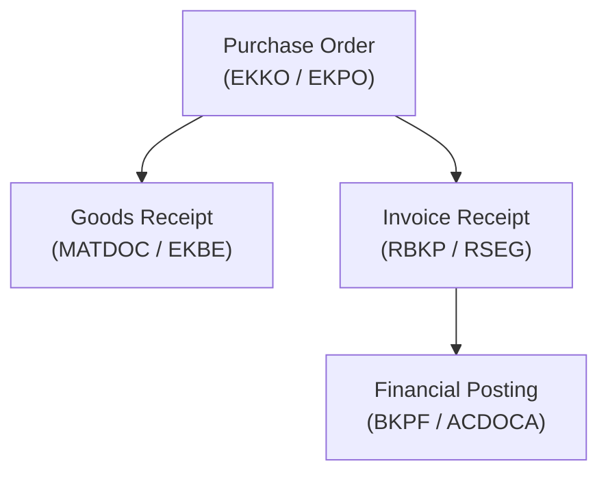
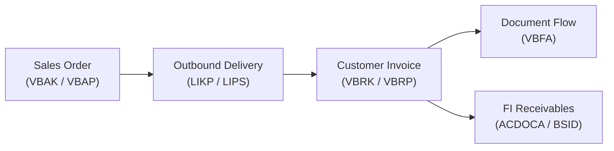

# SAP Standard Tables, Business Logic & Official Documentation Reference
## Comprehensive Enterprise Guide for SAP ERP (ECC), S/4HANA, BW, and SAP Datasphere

---

## 1. Official SAP Reference Portals & Catalogs

When looking up official SAP table definitions, CDS views, and business context, use these official resources:

| Portal | URL | Purpose & Content |
|---|---|---|
| **SAP Business Accelerator Hub** | [api.sap.com](https://api.sap.com) | Official directory of S/4HANA CDS Views, OData APIs, Events, and business object schemas (e.g. `I_JournalEntry`, `I_SalesOrder`, `I_PurchaseOrderAPI01`). |
| **SAP Help Portal** | [help.sap.com](https://help.sap.com) | Comprehensive product documentation, business process flows, configuration guides, and architecture for S/4HANA, Datasphere, and BW. |
| **SAP S/4HANA Feature Scope & Simplification List** | [help.sap.com/s4hana_op](https://help.sap.com/docs/SAP_S4HANA_ON-PREMISE) | Details the transition from ECC legacy tables (e.g. `BSEG`, `MSEG`, `COEP`) to Universal Journal (`ACDOCA`) and `MATDOC`. |
| **SAP Community Wiki & Blogs** | [community.sap.com](https://community.sap.com) | Practitioner guides on table relationships, extractor logic, and ABAP-to-SQL conversions. |

---

## 2. Finance & Controlling (FI/CO) — The Universal Journal & Master Data

### 2.1 Core Transaction Tables

| Table | Name & Business Purpose | Primary Keys | Key Foreign Relationships / Business Logic | Official Reference |
|---|---|---|---|---|
| **`ACDOCA`** | **Universal Journal Entry Line Items** The single source of truth in S/4HANA for GL, CO, AA, ML, and Profitability. | `RCLNT`, `RLDNR`, `RBUKRS`, `GJAHR`, `BELNR`, `DOCLN` | Joins to `BKPF` on `(RBUKRS, GJAHR, BELNR)`. Contains multi-currency amounts (`HSL` = local, `KSL` = group, `OSL` = document). Debit/Credit indicated by `DRCRK` (`S` = Debit, `H` = Credit). | [ACDOCA on SAP Help](https://help.sap.com/docs/SAP_S4HANA_ON-PREMISE/financial-accounting) |
| **`BKPF`** | **Accounting Document Header** Document header info (posting date, document type, user, currency). | `MANDT`, `BUKRS`, `BELNR`, `GJAHR` | Header table for both `ACDOCA` (S/4HANA) and `BSEG` (ECC). `BLART` = Doc Type, `BUDAT` = Posting Date, `CPUDT` = Entry Date. | [BKPF on SAP Business Hub](https://api.sap.com) |
| **`BSEG`** | **Accounting Document Segment** Classical FI line item table. In S/4HANA, still populated for open items and operational accounting. | `MANDT`, `BUKRS`, `BELNR`, `GJAHR`, `BUZEI` | `KOART` = Account Type (`S` = G/L, `D` = Customer, `K` = Vendor, `A` = Asset). `SHKZG` = Debit/Credit Indicator. | [BSEG Reference](https://help.sap.com) |
| **`BSIS` / `BSAS`** | **G/L Open / Cleared Items** | `MANDT`, `BUKRS`, `HKONT`, `GJAHR`, `BELNR`, `BUZEI` | `BSIS` contains open items; when cleared with payment, records move to `BSAS` with clearing date `AUGDT` and clearing doc `AUGBL`. | [FI Open Items Guide](https://help.sap.com) |
| **`BSID` / `BSAD`** | **Customer Open / Cleared Items (Accounts Receivable)** | `MANDT`, `BUKRS`, `KUNNR`, `GJAHR`, `BELNR`, `BUZEI` | `BSID` = Open customer invoices/debits. `BSAD` = Cleared customer payments. | [AR Documentation](https://help.sap.com) |
| **`BSIK` / `BSAK`** | **Vendor Open / Cleared Items (Accounts Payable)** | `MANDT`, `BUKRS`, `LIFNR`, `GJAHR`, `BELNR`, `BUZEI` | `BSIK` = Unpaid vendor invoices. `BSAK` = Paid vendor invoices with payment clearing doc. | [AP Documentation](https://help.sap.com) |

### 2.2 Master Data & Currency Tables

| Table | Name & Business Purpose | Primary Keys | Key Business Attributes | Official Reference |
|---|---|---|---|---|
| **`SKA1`** | **G/L Account Master (Chart of Accounts)** | `MANDT`, `KTOPL`, `SAKNR` | Client-independent GL definition. `BILKT` = Balance Sheet indicator, `GVTYP` = P&L category. | [Chart of Accounts Guide](https://help.sap.com) |
| **`SKB1`** | **G/L Account Master (Company Code)** | `MANDT`, `BUKRS`, `SAKNR` | Company-code specific settings. `WAERS` = Account currency, `XINTB` = Only automatic postings. | [GL Company Code](https://help.sap.com) |
| **`CSKS` / `CSKT`**| **Cost Center Master / Texts** | `MANDT`, `KOKRS`, `KOSTL`, `DATBI` | Time-dependent cost center master data. **Compounded to Controlling Area (`KOKRS`)**! Texts in `CSKT` joined on `SPRAS`. | [Cost Center Accounting](https://help.sap.com) |
| **`CEPC` / `CEPCT`**| **Profit Center Master / Texts** | `MANDT`, `PRCTR`, `DATBI`, `KOKRS` | Profit center organizational unit. Compounded to `KOKRS`. Texts in `CEPCT`. | [Profit Center Accounting](https://help.sap.com) |
| **`TCURR`** | **Exchange Rates** | `MANDT`, `KURST`, `FCURR`, `TCURR`, `GDATU` | Foreign exchange conversion rates. `GDATU` is stored inverted as `99999999 - YYYYMMDD` in SAP ECC/BW! | [Currency Translation Guide](https://help.sap.com) |
| **`TCURF`** | **Currency Conversion Factors** | `MANDT`, `KURST`, `FCURR`, `TCURR`, `GDATU` | Ratio factors (e.g. 1:100 for JPY to EUR). | [Exchange Rate Ratios](https://help.sap.com) |
| **`TCURX`** | **Decimal Places in Currencies** | `CURRKEY` | Defines non-standard decimal places (e.g. JPY has 0 decimals, BHD has 3). | [Currencies Decimals](https://help.sap.com) |

---

## 3. Sourcing & Procurement (MM - Procure-to-Pay / P2P)

### 3.1 Purchasing & Invoice Verification

| Table | Name & Business Purpose | Primary Keys | Key Foreign Relationships / Business Logic | Official Reference |
|---|---|---|---|---|
| **`EKKO`** | **Purchasing Document Header** Purchase orders, contracts, RFQs. | `MANDT`, `EBELN` | `BSART` = Order Type, `LIFNR` = Supplier, `EKORG` = Purchasing Org, `EKGRP` = Purchasing Group, `WAERS` = Currency. | [Purchasing on SAP Hub](https://api.sap.com) |
| **`EKPO`** | **Purchasing Document Item** Line item details of the PO. | `MANDT`, `EBELN`, `EBELP` | Joins to `EKKO` on `EBELN`. `MATNR` = Material, `WERKS` = Plant, `MENGE` = PO Quantity, `NETPR` = Net Price, `LOEKZ` = Deletion Flag. | [PO Items API](https://api.sap.com) |
| **`EKET`** | **Scheduling Agreement Delivery Schedule** | `MANDT`, `EBELN`, `EBELP`, `ETENR` | Delivery dates, confirmed dates (`EINDT`), and scheduled delivery quantities (`MENGE`). | [Scheduling Agreements](https://help.sap.com) |
| **`EKBE`** | **PO History (Purchasing Document History)** Tracks all Goods Receipts (`VGABE = 1`) and Invoices (`VGABE = 2`) against a PO item. | `MANDT`, `EBELN`, `EBELP`, `ZEKKN`, `VGABE`, `GJAHR`, `BELNR`, `BUZEI` | Crucial for three-way matching (PO vs GR vs IR) and Maverick spend detection. | [PO History Logic](https://help.sap.com) |
| **`RBKP`** | **Invoice Receipt Header** Supplier vendor invoices entered in MIRO. | `MANDT`, `BELNR`, `GJAHR` | `LIFNR` = Invoicing party, `RBSTAT` = Invoice status (`5` = Posted), `RMWWR` = Gross invoice amount. | [Invoice Verification](https://help.sap.com) |
| **`RSEG`** | **Invoice Receipt Item** Line items of supplier invoice matched to PO. | `MANDT`, `BELNR`, `GJAHR`, `BUZEI` | Joins to `EKPO` on `(EBELN, EBELP)`. Contains invoiced quantity (`MENGE`) and invoiced amount (`WRBTR`). | [Incoming Invoices](https://help.sap.com) |

### 3.2 Inventory Management & Material Master

| Table | Name & Business Purpose | Primary Keys | Key Business Attributes | Official Reference |
|---|---|---|---|---|
| **`MATDOC`** | **Material Documents (S/4HANA Universal)** Unified table for goods movements replacing `MKPF` and `MSEG`. | `MANDT`, `MBLNR`, `MJAHR`, `ZEILE` | Contains Goods Issue, Goods Receipt, and Transfer Postings. `BWART` = Movement Type (e.g. `101` = GR for PO, `201` = GI for Cost Center, `261` = GI for Production). | [MATDOC on SAP Help](https://help.sap.com) |
| **`MARA`** | **General Material Data (Master Data)** | `MANDT`, `MATNR` | Client-level material master. `MTART` = Material Type (e.g. `FERT` = Finished, `ROH` = Raw), `MATKL` = Material Group, `MEINS` = Base Unit. | [Material Master Guide](https://help.sap.com) |
| **`MARC`** | **Plant Data for Material** | `MANDT`, `MATNR`, `WERKS` | Plant-level inventory and MRP parameters. `DISPO` = MRP Controller, `BESKZ` = Procurement Type (`E` = In-house, `F` = External). | [Plant Stock Guide](https://help.sap.com) |
| **`MARD`** | **Storage Location Data for Material** | `MANDT`, `MATNR`, `WERKS`, `LGORT` | Unrestricted stock (`LABST`), blocked stock (`SPEME`), stock in transit. | [Storage Location Stock](https://help.sap.com) |
| **`MBEW`** | **Material Valuation** | `MANDT`, `MATNR`, `BWKEY`, `BWTAR` | Stock value (`SALK3`), standard price (`STPRS`), moving average price (`VERPR`), price control (`VPRSV` = `S` or `V`). | [Material Valuation](https://help.sap.com) |
| **`LFA1`** | **Vendor Master (General Data)** | `MANDT`, `LIFNR` | General supplier information (Name, Country `LAND1`, Tax Number, Address). Shared across company codes. | [Business Partner Vendor](https://api.sap.com) |
| **`LFB1`** | **Vendor Master (Company Code Data)** | `MANDT`, `LIFNR`, `BUKRS` | Reconciliation account in GL (`AKONT`), Payment terms (`ZTERM`), Payment block (`SPERR`). | [Vendor Accounting](https://help.sap.com) |

---

## 4. Sales & Distribution (SD - Order-to-Cash / O2C)

### 4.1 Sales Order Flow Architecture

| Table | Name & Business Purpose | Primary Keys | Key Foreign Relationships / Business Logic | Official Reference |
|---|---|---|---|---|
| **`VBAK`** | **Sales Document Header** Sales orders, quotations, inquiries, credit memos. | `MANDT`, `VBELN` | `AUART` = Sales Doc Type (e.g. `TA`/`OR` = Standard Order), `VKORG` = Sales Org, `VTWEG` = Distribution Channel, `SPART` = Division, `KUNNR` = Sold-to party, `NETWR` = Net Value. | [Sales Order API on SAP Hub](https://api.sap.com) |
| **`VBAP`** | **Sales Document Item** Order lines, quantities, prices, materials. | `MANDT`, `VBELN`, `POSNR` | Joins to `VBAK` on `VBELN`. `MATNR` = Material, `KWMENG` = Order Quantity, `NETPR` = Net Price, `ABGRU` = Rejection Reason (crucial filter in Start Routines!). | [Sales Items Guide](https://help.sap.com) |
| **`VBKD`** | **Sales Document Business Data** | `MANDT`, `VBELN`, `POSNR` | Invoicing dates, payment terms (`ZTERM`), Incoterms (`INCO1`), currency conversion date. | [Sales Business Data](https://help.sap.com) |
| **`VBEP`** | **Sales Document Schedule Line** | `MANDT`, `VBELN`, `POSNR`, `ETENR` | Confirmed delivery dates (`EDATU`) and confirmed quantities (`BMENG`). | [Schedule Lines](https://help.sap.com) |
| **`LIKP`** | **Outbound Delivery Header** Shipping document header. | `MANDT`, `VBELN` | `LFART` = Delivery Type, `KUNNR` = Ship-to party, `WADAT_IST` = Actual Goods Issue date. | [Outbound Delivery API](https://api.sap.com) |
| **`LIPS`** | **Outbound Delivery Item** Delivered quantities, picking status. | `MANDT`, `VBELN`, `POSNR` | Joins to `LIKP` on `VBELN`. `LFIMG` = Actual delivered quantity in sales unit. Links back to `VBAP` via `(VGBEL, VGPOS)`. | [Delivery Items](https://help.sap.com) |
| **`VBRK`** | **Billing Document Header** Customer invoice, debit/credit memo. | `MANDT`, `VBELN` | `FKART` = Billing Type (`F2` = Invoice), `KUNAG` = Sold-to party, `KUNRG` = Payer, `NETWR` = Invoice Net Amount. | [Customer Billing API](https://api.sap.com) |
| **`VBRP`** | **Billing Document Item** | `MANDT`, `VBELN`, `POSNR` | Joins to `VBRK` on `VBELN`. Links back to Delivery via `(VGBEL, VGPOS)`. `FKIMG` = Billed quantity. | [Billing Items](https://help.sap.com) |
| **`VBFA`** | **Sales Document Flow** Audit trail linking preceding and subsequent documents across O2C. | `MANDT`, `VBELV`, `POSNV`, `VBELN`, `POSNN`, `VBTYP_N` | `VBELV` = Preceding doc (Order), `VBELN` = Subsequent doc (Delivery or Invoice). `VBTYP_V` / `VBTYP_N` indicate doc types (`C` = Order, `J` = Delivery, `M` = Invoice). | [Document Flow Logic](https://help.sap.com) |
| **`KNA1`** | **Customer Master (General Data)** | `MANDT`, `KUNNR` | Customer Name, Country (`LAND1`), City, Postal Code, Industry (`BRSCH`). | [Customer Master on SAP Hub](https://api.sap.com) |
| **`KNB1`** | **Customer Master (Company Code Data)** | `MANDT`, `KUNNR`, `BUKRS` | Reconciliation account in GL (`AKONT`), Payment terms (`ZTERM`), Dunning data. | [Customer Accounting](https://help.sap.com) |
| **`KNVV`** | **Customer Master (Sales Data)** | `MANDT`, `KUNNR`, `VKORG`, `VTWEG`, `SPART` | Sales organization settings, pricing group, customer group (`KDGRP`), shipping conditions. | [Customer Sales Areas](https://help.sap.com) |

---

## 5. Production Planning & Plant Maintenance (PP/PM)

| Table | Name & Business Purpose | Primary Keys | Key Foreign Relationships / Business Logic | Official Reference |
|---|---|---|---|---|
| **`AUFK`** | **Order Master Data (Internal & Production Orders)** | `MANDT`, `AUFNR` | `AUFART` = Order Type, `AUTYP` = Order Category (`10` = Production Order, `01` = Internal Order), `KTEXT` = Description, `WERKS` = Plant. | [Production Orders API](https://api.sap.com) |
| **`AFKO`** | **Production Order Header** | `MANDT`, `AUFNR` | Joins to `AUFK` on `AUFNR`. Planned order start/finish dates (`GSTRP`, `GLTRP`), routing number (`AUFPL`). | [PP Order Header](https://help.sap.com) |
| **`AFPO`** | **Production Order Item** | `MANDT`, `AUFNR`, `POSNR` | Material produced (`MATNR`), planned quantity (`PSMNG`), delivered quantity (`WEMNG`). | [PP Order Item](https://help.sap.com) |
| **`EQUI`** | **Equipment Master (Plant Maintenance)** | `MANDT`, `EQUNR` | Technical equipment in plant maintenance. Description, technical object type, maintenance plant (`SWERK`). | [Maintenance Equipment](https://api.sap.com) |
| **`IFLOT`** | **Functional Location (Plant Maintenance)** | `MANDT`, `TPLNR` | Hierarchical functional locations for assets. | [Functional Locations](https://help.sap.com) |

---

## 6. S/4HANA Modernization Mapping (Classical ECC Tables $\rightarrow$ S/4HANA Core)

When converting legacy BW transformations or ABAP extraction routines, replace obsolete tables with modern S/4HANA equivalents:

| Classical ECC Table | Obsolete / Compatibility View | Modern S/4HANA Table / Core CDS View | Business Note |
|---|---|---|---|
| `COEP`, `COSP`, `COSS` | Emulated as Views | **`ACDOCA`** | Secondary and primary cost postings are merged into the Universal Journal. |
| `BSEG`, `BSIS`, `BSAS` | Still exist, but secondary index tables are obsolete | **`ACDOCA`** / **`I_JournalEntryItem`** | Reporting should read `ACDOCA` or CDS View `I_JournalEntryItem`. |
| `MKPF`, `MSEG` | Emulated as Views | **`MATDOC`** / **`I_MaterialDocumentItem`** | Single inventory movement table with sub-second performance. |
| `KNA1`, `LFA1` | Core tables remain, but maintained via Business Partner | **`BUT000`** / **`I_BusinessPartner`** | Customer and Vendor master records are consolidated into Business Partners (`BP`). |
| `VBAK`, `VBAP` | Active in S/4HANA | **`I_SalesOrder`**, **`I_SalesOrderItem`** | Core CDS views encapsulate document flow and status logic. |
| `EKKO`, `EKPO` | Active in S/4HANA | **`I_PurchaseOrderAPI01`** | CDS views provide out-of-the-box text associations and calculated quantities. |
