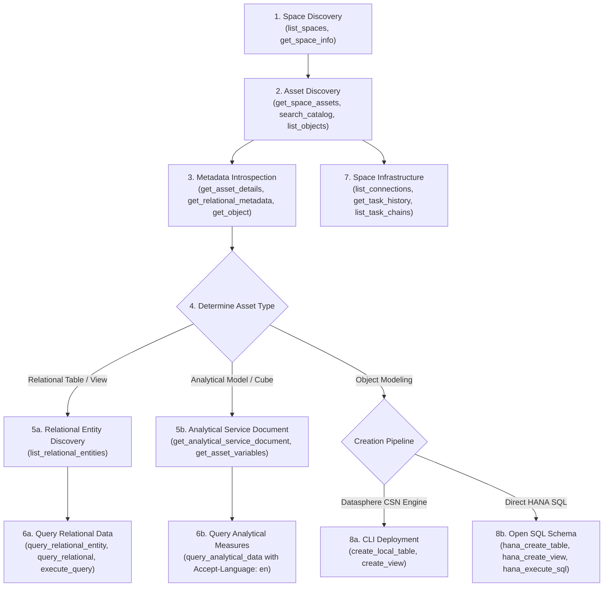

# SAP Datasphere & BW2DSP Expert Guide

This skill equips autonomous AI agents with domain expertise to orchestrate, query, inspect, and migrate data in **SAP Datasphere** and **SAP HANA Cloud** via the MCP Server deployed on **SAP BTP Kyma**.

---

## 1. System Architecture & Operational Context

### 1.1 SAP Datasphere Architecture & Boundaries
* **Spaces**: Logical partitions within a Datasphere tenant used for data modeling, security, and resource allocation (e.g. `FTDWH_100_INT`).
* **Technical User / Service Principal**: Authenticated via OAuth 2.0 (`client_credentials` grant) against SAP Cloud Identity Service.
* **Database Users / Open SQL Schemas (`DSP_OPEN_SCHEME`)**:
  - Dedicated HANA database user provisioned inside a space.
  - Grants direct SQL (ODBC/JDBC/TLS) connectivity to the underlying SAP HANA Cloud database on port `443`.
  - **Schema Isolation Rule**: Write operations (`CREATE`, `ALTER`, `DROP`, `INSERT`, `UPDATE`, `DELETE`) are strictly confined to `DSP_OPEN_SCHEME` (`<SPACE>#<USER>`).
* **Catalog vs Repository vs Consumption Engine**:
  - **Catalog OData API** (`/api/v1/datasphere/consumption/catalog`): Global discovery of spaces, catalog assets, and OData metadata.
  - **Relational Data API**: Direct record retrieval from views and local tables.
  - **Analytical Engine**: Multi-dimensional OLAP engine supporting Star Schemas, calculated measures, and analytical models (`/api/v1/datasphere/consumption/analytical`).

### 1.2 SAP BTP Kyma Environment
* **Transport**: Streamable HTTP Server-Sent Events (SSE) on port `8080` (endpoint `/mcp`).
* **Ingress / Gateway**: Managed via Kyma `APIRule` (`gateway.kyma-project.io/v1alpha1`).
* **Health Endpoint**: `GET /health` returns `{ "status": "healthy", "service": "sap-datasphere-mcp" }`.
* **Authentication**: Token-authenticated HTTP requests (`Authorization: Bearer <MCP_HTTP_AUTH_TOKEN>`).

---

## 2. Tool Relationship & Inter-Tool Dependency Map

Datasphere operations follow a sequential, dependency-driven workflow. Agents must not guess technical names or entity sets without first querying upstream catalog metadata.



### Critical Inter-Tool Rules:
1. **Never skip `list_relational_entities` before querying relational data**:
   - In SAP Datasphere, if an asset technical name begins with a digit (e.g., `4VD_SUPPLIER` or `1LR_100_FTWPINV6_01`), the internal OData entity set name is prepended with an underscore (`_4VD_SUPPLIER`, `_1LR_100_FTWPINV6_01`).
   - Calling `query_relational_entity` with an unverified entity name will return `404 Not Found`.
2. **Analytical Engine Language Header**:
   - Every analytical request requires `'Accept-Language': 'en'`. Without it, Datasphere returns `400 INVALID_LANGUAGE_HEADER`. The MCP client handles this automatically.
3. **CSN Format for CLI Object Creation**:
   - `@sap/datasphere-cli` rejects raw SQL or plain `{ name, columns }` payloads. Local tables must include `@ObjectModel.modelingPattern: { "#": "DATA_STRUCTURE" }` and `@ObjectModel.supportedCapabilities: [{ "#": "DATA_STRUCTURE" }]`.

---

## 3. Tool Decision Matrix: When to Use Which Tool

| Objective | Recommended Tool(s) | Pre-requisites / Inputs | Expected Output |
|---|---|---|---|
| **Check connectivity** | `test_connection` | None | Tenant host, token status, latency |
| **Find accessible spaces** | `list_spaces` | None | List of space names and labels |
| **Inspect a space** | `get_space_info` | `space_id` | Space metadata, label, storage |
| **Find tables/views in a space** | `get_space_assets` | `space_id` | Assets with analytical & relational capability flags |
| **Search catalog by keyword** | `search_catalog` | `query`, optional `space_id` | Matching assets across catalog |
| **Inspect table columns & schema** | `get_table_schema` or `get_relational_metadata` | `space_id`, `table_name` / `asset_id` | Column names, data types, primary keys |
| **Find entity set name** | `list_relational_entities` | `space_id`, `asset_id` | Exact OData entity set names |
| **Query table data** | `query_relational_entity` | `space_id`, `asset_id`, `entity_name`, `$top`, `$select` | JSON records from table/view |
| **Query analytical model** | `query_analytical_data` | `space_id`, `asset_id`, `dimensions`, `measures` | Multi-dimensional aggregated metric records |
| **Inspect Space Connections** | `list_connections` | `space_id` | Active remote systems (ABAP, SAPBW, S3, HANA) |
| **Inspect ETL / Replication tasks** | `get_task_history` | `space_id`, `object_id` | Execution logs, status, run duration |
| **Create Local Table (Datasphere)** | `create_local_table` | `space_id`, `table_name`, `columns` | CSN entity deployed to space catalog |
| **Direct SQL Execution in HANA** | `hana_execute_sql` | `sql_query` | Query results (strictly scoped to `DSP_OPEN_SCHEME`) |
| **Create Table in Open SQL Schema** | `hana_create_table` | `table_name`, `columns_definition` | Column table created in `DSP_OPEN_SCHEME` |
| **Create View in Open SQL Schema** | `hana_create_view` | `view_name`, `select_query` | SQL view created in `DSP_OPEN_SCHEME` |
| **Inspect Open Schema Tables/Views**| `hana_list_tables`, `hana_list_views` | None | SYS catalog list of user's schema objects |
| **Audit Space Health** | `audit_space_health` | `space_id` | Overall score, category breakdown, real faults |
| **Audit Table Health** | `audit_table_health` | `table_name`, `space_id` | Key integrity, nullability, documentation score |
| **Column Distribution Profiling** | `analyze_column_distribution` | `space_id`, `asset_id`, `column_name` | Distinct counts, nulls, frequencies |

---

### 3.1 Practical Invocation Recipes (Tested on Live Tenant & `FTDWH_100_INT`)

The following tested JSON payloads demonstrate correct tool usage:

#### Recipe 1: Foundation & Open SQL Probe
```json
// Test tenant OAuth2 connectivity
{ "tool": "test_connection", "arguments": {} }

// Probe SAP HANA Cloud Open SQL Schema
{ "tool": "test_hana_connection", "arguments": { "space_id": "FTDWH_100_INT" } }
```

#### Recipe 2: Space & Asset Discovery
```json
// List spaces in tenant
{ "tool": "list_spaces", "arguments": { "include_details": false } }

// Discover top 25 catalog assets in FTDWH_100_INT
{ "tool": "get_space_assets", "arguments": { "space_id": "FTDWH_100_INT", "top": 25 } }
```

#### Recipe 3: Table Schema & Health Audit
```json
// Inspect table columns, types, and primary keys
{ "tool": "get_table_schema", "arguments": { "space_id": "FTDWH_100_INT", "table_name": "1LR_100_FTWPINV6_01" } }

// In-depth table health audit
{ "tool": "audit_table_health", "arguments": { "space_id": "FTDWH_100_INT", "table_name": "1LR_100_FTWPINV6_01" } }
```

#### Recipe 4: Entity Resolution & Relational Data Extraction
```json
// 1. Resolve internal OData entity set name (returns "_1LR_100_FTWPINV6_01")
{ "tool": "list_relational_entities", "arguments": { "space_id": "FTDWH_100_INT", "asset_id": "1LR_100_FTWPINV6_01" } }

// 2. Query relational records using OData
{ 
  "tool": "query_relational_entity", 
  "arguments": { 
    "space_id": "FTDWH_100_INT", 
    "asset_id": "1LR_100_FTWPINV6_01", 
    "select": "BBP_INV_ID,LOGSYS,FISCYEAR,FTWCINVPT", 
    "top": 10 
  } 
}

// 3. Or query using SQL (server extracts target table automatically)
{ 
  "tool": "execute_query", 
  "arguments": { 
    "space_id": "FTDWH_100_INT", 
    "sql_query": "SELECT \"BBP_INV_ID\", \"FISCYEAR\" FROM \"1LR_100_FTWPINV6_01\" LIMIT 10" 
  } 
}
```

#### Recipe 5: Column Statistical Profiling
```json
// CRITICAL: Must target a concrete column name; '*' is strictly rejected
{ 
  "tool": "analyze_column_distribution", 
  "arguments": { 
    "space_id": "FTDWH_100_INT", 
    "asset_id": "1LR_100_FTWPINV6_01", 
    "column_name": "BBP_INV_ID", 
    "sample_size": 1000 
  } 
}
```

#### Recipe 6: Space Deployed Objects & Governance Audit
```json
// Audit all deployed modeling objects (evidence-grounded, zero mock data)
{ "tool": "get_deployed_objects", "arguments": { "space_id": "FTDWH_100_INT" } }

// Complete space health inspection
{ "tool": "audit_space_health", "arguments": { "space_id": "FTDWH_100_INT" } }
```

---

### 3.2 Anti-Patterns & Common Pitfalls to Avoid

| Anti-Pattern | Bad Invocation | Why it Fails | Correct Solution |
|---|---|---|---|
| **Wildcard Column Profiling** | `analyze_column_distribution` with `column_name: "*"` | Rejected with code `-32602` ("column_name cannot be wildcard '*'"). Statistical distribution requires a single column. | Pass specific column: `column_name: "BBP_INV_ID"`. To profile all columns, call `get_table_schema` first. |
| **Unresolved Digit-Prefixed Entities** | Querying `/1LR_100_FTWPINV6_01` directly via raw OData | OData entity naming rules require an underscore for identifiers starting with a digit. Results in `404 Not Found`. | Call `list_relational_entities` first, or use `query_relational_entity` (which handles prefixing automatically). |
| **Malformed SQL Table Extraction** | Manually constructing URLs with SQL string `SELECT * FROM "table"` | Creates malformed URLs with empty segments (`//`). | Use `execute_query` or `smart_query`, which cleanly extract and sanitize the table identifier. |
| **Missing HTTP SSE Accept Header** | HTTP client calls missing `Accept` header | Server responds with `HTTP 406 Not Acceptable` on Streamable HTTP transport. | Always send `Accept: application/json, text/event-stream`. |
| **Fabricating Mock Data** | Returning synthetic records on catalog errors | Violates data integrity and hides real configuration or credential issues. | Let real errors surface or inspect upstream errors using `audit_space_health` and `test_connection`. |

---

## 4. BW to Datasphere (BW2DSP) Migration & Validation Checks

When assisting with migration from SAP Business Warehouse (SAP BW 7.5 / BW/4HANA / BW Bridge) to SAP Datasphere:

### 4.1 Step-by-Step BW2DSP Migration Workflow

```
[BW Provider Inspection] ──> [BW Query Analysis] ──> [Source Table Validation] ──> [ABAP Routine Translation] ──> [View Validation & Deploy]
```

1. **Inspect BW Source InfoProvider**:
   - Tool: `bw_inspect_provider`
   - Inputs: `alias` (BW connection alias), `project`, `technicalName` (e.g. ADSO, CompositeProvider `2CC...`).
   - Purpose: Extract dimensions, key figures, navigation attributes, and underlying InfoObjects.
2. **Review BW Query Design & Calculation Logic**:
   - Tools: `bw_list_queries`, `bw_read_query`, `bw_review_query_design`, `bw_get_query_spec`.
   - Purpose: Retrieve restricted key figures (RKFs), calculated key figures (CKFs), formulas, variables, and filter conditions.
   - Conversion Rule:
     - BW Filter variables $\rightarrow$ Datasphere Story Filters or Input Parameters.
     - BW Exception aggregation $\rightarrow$ Datasphere Analytic Model Calculated Measures.
     - BW Compounding $\rightarrow$ Concatenated keys or Dimension associations.
3. **Verify Source Tables in Datasphere**:
   - Tool: `check_source_tables`
   - Inputs: `space_id`, `source_tables` (array of table technical names).
   - Purpose: Verifies that replicated SAP ERP / S/4HANA / BW tables (e.g. `0FI_ACDOCA_10`, `1LR_EKKO_01`) are deployed and active in the target space before referencing them in downstream views.
4. **Translate ABAP Routines to SQL / CDS**:
   - Tools: `analyze_abap_file`, `get_abap_conversion_guide`.
   - Conversion Patterns:
     - `SELECT SINGLE ... INTO ... WHERE` $\rightarrow$ SQL `LEFT JOIN` or subquery.
     - `LOOP AT itab ... ENDLOOP` $\rightarrow$ Set-based SQL aggregation / `CASE WHEN`.
     - Currency / Unit translation $\rightarrow$ Datasphere Currency Conversion nodes.
5. **Validate & Deploy SQL View**:
   - Tool: `validate_sql_view`
   - Checks:
     - No dangerous operations (`DROP`, `TRUNCATE`, `ALTER`).
     - All referenced source tables exist in the target space.
     - Correct projection list and valid SQL syntax.
   - Tool: `deploy_view_to_datasphere` or `hana_create_view` to deploy.

> [!TIP]
> For in-depth conversion patterns, CSN JSON templates, and complete ABAP Start/Field/End/Expert routine translations to HANA SQL CTEs, consult the comprehensive guide:
> [BW to Datasphere ABAP Migration Handbook](file:///C:/Users/kpjee/.gemini/antigravity/scratch/sap-datasphere-mcp/skills/sap-datasphere-expert/references/bw2dsp-abap-migration.md).


---

## 5. Security & Governance Guardrails

1. **Zero Secret Leakage**:
   - Never print, echo, log, or include passwords, client secrets, Bearer tokens, or authorization codes in responses or artifacts.
   - The MCP server automatically masks all sensitive fields via `sanitizeForLLM()` and `maskSensitiveObject()`.
2. **Strict Space Boundary Enforcement**:
   - If the user designates a specific space (e.g. `FTDWH_100_INT`), all inspection, creation, and deployment operations must target **only** that space.
   - Never touch, modify, or deploy objects into other production or integration spaces.
3. **Schema Isolation Guard (`DSP_OPEN_SCHEME`)**:
   - Direct SQL executions via `hana_*` tools are locked to the user's Open SQL Schema.
   - Any DDL/DML attempting to modify other schemas or system tables (`SYS`, `_SYS_REPO`, other space schemas) is intercepted and rejected before reaching the database.
4. **Accidental Data Loss Prevention**:
   - Never issue `DROP TABLE`, `DROP VIEW`, or `TRUNCATE` against pre-existing production or shared objects.
   - Only temporary test objects (prefixed with `TMP_` or `TEST_`) created during the current session may be cleaned up.
