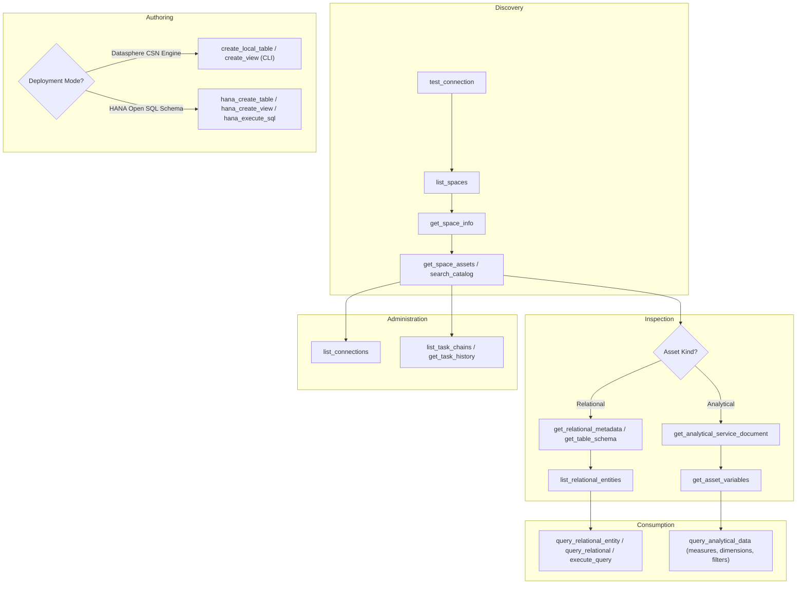
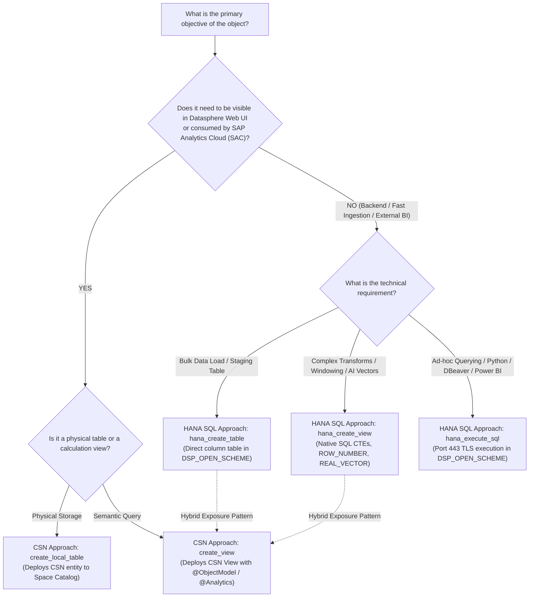
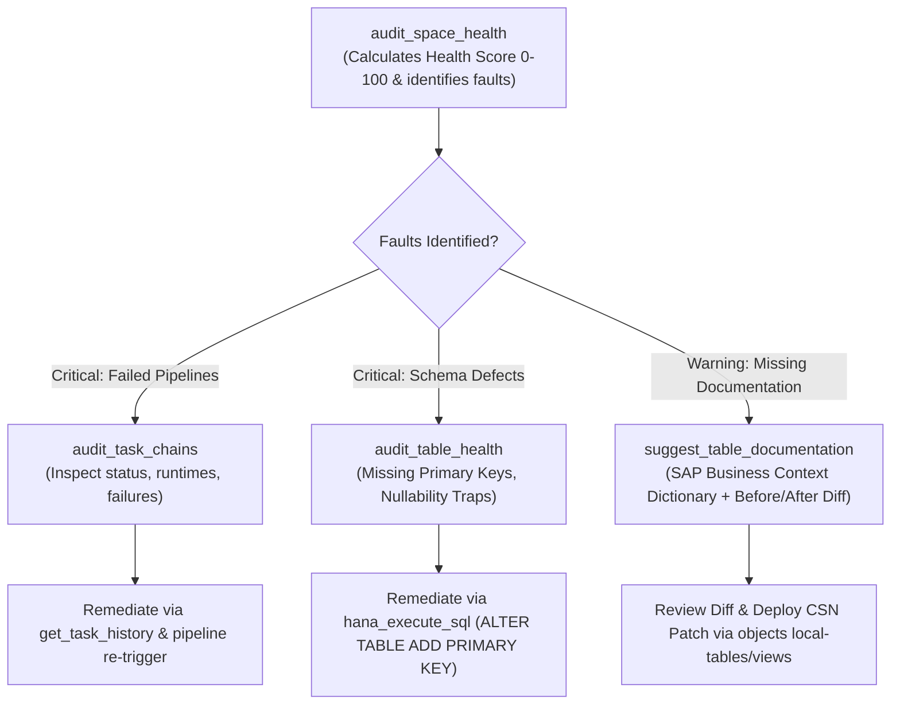

# SAP Datasphere Platform & Exploration Expert Guide

This skill provides autonomous AI agents with full operational mastery over the **SAP Datasphere Platform** and underlying **SAP HANA Cloud** database via the SAP Datasphere MCP Server.

---

## 1. Architectural Model & Boundary Rules

### 1.1 Tenant & Spaces
* **Tenant**: The top-level SAP Datasphere instance running in SAP BTP.
* **Space & Schema Selection**:
  - `FTDWH_100_INT` is the **default option** for space and schema operations in the current session.
  - **Context-Driven Schema Selection**: Tools and agents must dynamically target whichever space or schema the user requests in context. For the current environment, access is provisioned for the `FTDWH` space (e.g. `FTDWH_100_INT` or other `FTDWH` schemas).
  - **Rule**: All operations must remain within authorized spaces. Attempting to modify system schemas (`SYS`, `_SYS_REPO`) or unauthorized spaces is blocked by the **Schema Isolation Guard**.

### 1.2 Access Layers
1. **Consumption Catalog API** (`/api/v1/datasphere/consumption/catalog`):
   - Global discovery of spaces, deployed assets, entity metadata, and lineage.
2. **Relational Data API**:
   - Access to relational data in Local Tables, Remote Tables, and Views.
   - **Crucial Rule on Digit-Prefixed Assets**: If an asset begins with a digit (e.g., `4VD_SUPPLIER` or `1LR_100_FTWPINV6_01`), Datasphere's OData service prepends an underscore to the entity set name (e.g., `_4VD_SUPPLIER`). Always resolve the exact entity set name via `list_relational_entities` before querying!
3. **Analytical Engine API** (`/api/v1/datasphere/consumption/analytical`):
   - Multi-dimensional OLAP engine querying Analytic Models, Star Schemas, and Cube Views.
   - **Crucial Rule on Language Header**: Every analytical request requires `'Accept-Language': 'en'`. Without it, the engine rejects queries with `400 INVALID_LANGUAGE_HEADER`.
4. **Direct SAP HANA Cloud Open SQL Schema (`DSP_OPEN_SCHEME`)**:
   - Direct SQL (ODBC/JDBC/TLS on port 443) to the space's Open SQL Schema.
   - Supports dynamic `schema_name` parameter, defaulting to `DSP_OPEN_SCHEME` / `FTDWH_100_INT`.
   - **Schema Isolation Guard**: Write operations (`CREATE`, `ALTER`, `DROP`, `INSERT`, `UPDATE`, `DELETE`, `TRUNCATE`) are strictly verified against authorized schemas (`FTDWH` space / `DSP_OPEN_SCHEME`). Any attempt to modify system schemas (`SYS`, `_SYS_REPO`) or unauthorized spaces is intercepted and rejected.
5. **Datasphere CLI (`@sap/datasphere-cli`)**:
   - Object creation and deployment tool.
   - **Crucial Rule on CSN Payload**: Payloads must strictly follow Core Schema Notation (CSN) format. Plain JSON objects without CSN structure will be rejected by the CLI.

---

## 2. MCP Tool Architecture & Sequential Call Workflow

---

## 2.1 Architectural Decision Guide: CSN-Based vs. Direct HANA SQL Approach

Every autonomous agent and MCP client must evaluate the following decision criteria before choosing how to author or deploy objects:

### Comprehensive Comparison Matrix

| Architectural Dimension | CSN-Based Object Creation (`create_local_table`, `create_view`) | Direct HANA SQL Approach (`hana_create_table`, `hana_create_view`, `hana_execute_sql`) |
|---|---|---|
| **Target Location** | Datasphere Space Catalog (`FTDWH_100_INT`) | Underlying SAP HANA Cloud Open SQL Schema (`DSP_OPEN_SCHEME`) |
| **Datasphere Web UI** | **Visible & Editable**: Appears in Data Builder, Graphical View Builder, and Business Builder. | **Invisible in Data Builder** until explicitly exposed/imported as a Database User Table/View. |
| **SAC & Analytic Models** | **Native Consumption**: Can directly serve as source for Analytic Models, Star Schemas, and SAC Stories. | Consumable via external Database User connection or after being wrapped in a CSN view. |
| **Semantic Modeling** | **Rich CDS Semantics**: `@ObjectModel.modelingPattern: #FACT/#DIMENSION`, Text Associations, Hierarchies, Currency Conversion nodes. | Standard SQL DDL (`COMMENT ON`, constraints, primary keys). |
| **Execution Latency** | Higher creation latency (compilation through Datasphere OData Repository & CLI). | **Sub-second execution**: Direct physical DDL/DML on port 443 with zero metadata compilation overhead. |
| **Advanced SQL Features** | Standard SQL subset supported by Datasphere View Builder. | **Full Native HANA SQL**: Window functions (`ROW_NUMBER`, `DENSE_RANK`), recursive CTEs, vector search (`REAL_VECTOR`, `COSINE_SIMILARITY`), full-text indexing, UDFs. |
| **Ingestion Suitability** | Slower for mass raw data staging. Best for curated business entities. | **Ideal for High-Speed Ingestion**: High-throughput bulk loading via Python, JDBC, ODBC, Spark, Kafka. |
| **Row-Level Security** | **Data Access Controls (DAC)**: Integrated with Datasphere business users. | SQL View filtering or database user grants. |
| **Authorization Guard** | Authenticated via Service Principal OAuth 2.0. | Authenticated via Database User, strictly locked to `DSP_OPEN_SCHEME` by Schema Isolation Guard. |

### The Production "Hybrid Bridge" Pattern
The recommended enterprise design pattern combines the speed of HANA SQL with the governance of CSN:
1. **Stage & Transform (HANA SQL)**: Ingest raw data and perform complex multi-step CTE deduplication inside `DSP_OPEN_SCHEME` using `hana_create_table` and `hana_create_view`.
2. **Expose & Govern (CSN)**: Deploy a lightweight CSN View (`create_view`) over the finalized HANA table, annotating it with `@Analytics.dataCategory: #CUBE` for immediate consumption in SAP Analytics Cloud!

---

## 2.2 Space Administrator & Health Diagnosis Workflow

Space Administrators are responsible for ensuring that all data assets within an authorized space (such as `FTDWH_100_INT`) are properly governed, well-documented, structurally sound, and backed by healthy data pipelines.

### 1. Space Health Score Calculation
`audit_space_health` computes a single score (0-100) reflecting overall space posture:
* **Starting Score**: 100
* **Critical Faults** (Failed task chains, empty critical tables): -25 pts each
* **Warning Faults** (Undocumented tables, schema anomalies): -5 pts each
* **Documentation Penalty**: Scaled based on documented percentage across all space assets.
* **Status**: `HEALTHY` (>=80), `WARNING` (50-79), `CRITICAL` (<50).

### 2. Table-Specific Deep Diagnosis (`audit_table_health`)
Provides structural health for a specific table:
* **Primary Key Audit**: Checks if the table lacks a primary key, which prevents incremental change data capture (CDC) and degrades join performance.
* **Documentation Coverage**: Computes column-level documentation coverage ratio.
* **Activity & Row Count**: Introspects table row counts via `HanaClient` / `DatasphereClient` to confirm whether the table contains active data or is orphaned.

### 3. Context-Aware Documentation Generation (`suggest_table_documentation`)
When assets lack descriptions or use raw German ERP technical abbreviations (`VBELN`, `POSNR`, `KUNNR`, `LIFNR`, `ACDOCA` fields, etc.):
* Maps technical column names to standard SAP business descriptions using the built-in Enterprise SAP Business Context Dictionary.
* Returns a structured **Before & After Diff** (`currentLabel` vs `suggestedLabel` and `confidence`).
* Generates a ready-to-deploy **CSN Patch Preview** annotating entities with `@EndUserText.label` and `@EndUserText.quickInfo`, enabling space administrators to review and deploy changes directly as-is.

### 4. Volume & Performance Optimization Advisor (`audit_performance_optimizations`)
Diagnoses existing data pipelines, tables, and views to detect unoptimized configurations based on real data volume, execution runtimes, and memory consumption:
* **High-Volume Tables (>5M rows)**: Identifies unpartitioned monolithic tables (`ACDOCA`, `VBAP`, `EKPO`) that cause full table scans and high memory consumption. Provides concrete `ALTER TABLE ... PARTITION BY RANGE (GJAHR)` remediation scripts.
* **Missing Primary Keys on High-Volume Datasets**: Flags tables exceeding row thresholds (e.g. >100k rows) lacking unique keys, which breaks Delta Change Data Capture (CDC) replication.
* **Computationally Heavy Unpersisted Views**: Detects views joining millions of underlying records without View Persistency, causing repetitive dynamic joins and query latency >8s on SAC dashboards. Recommends `@Datasphere.persistency` cache configurations.
* **Inefficient Full-Table ETL Pipelines**: Audits task chains and replication flows to catch recurring full-table extractions on large datasets (>500k records) and advises migration to "Initial and Delta" CDC mode, cutting pipeline durations by ~90%.
* **Synthesis & Savings**: Computes an Overall Optimization Score (0-100), estimated memory savings (MB), and a prioritized actionable remediation checklist.

---

## 3. Tool Mapping & Decision Matrix

This matrix instructs MCP clients on **when to call each tool**, the **mandatory prerequisites**, **input parameters**, and **expected outputs**.

| Category | MCP Tool Name | When to Call | Prerequisites / Dependencies | Key Inputs & Format | Expected Output |
|---|---|---|---|---|---|
| **System** | `test_connection` | First call in any session to verify tenant health, latency, and auth token validity. | None | None | `{ status: "connected", latencyMs: 250, user: "..." }` |
| **Space** | `list_spaces` | To discover available spaces accessible to the service principal. | None | Optional: `$top`, `$skip` | List of spaces with `id`, `label`, `storageQuota` |
| **Space** | `get_space_info` | To retrieve detailed storage, memory allocation, and settings for a space. | `list_spaces` | `space_id: "FTDWH_100_INT"` | Space metadata, status, limits |
| **Catalog** | `get_space_assets` | To list all tables, views, and models deployed inside a space. | `list_spaces` | `space_id: "FTDWH_100_INT"` | Array of assets with technical names, labels, types |
| **Catalog** | `search_catalog` | To search for assets across spaces by keyword or business name. | None | `query: "Sales Order"`, optional `space_id` | Matching catalog entries with asset IDs and spaces |
| **Catalog** | `get_asset_details` | To inspect deep metadata, descriptions, tags, and lineage of a catalog asset. | `search_catalog` or `get_space_assets` | `asset_id: "..."` | Full catalog metadata including tags and terms |
| **Relational** | `get_relational_metadata` | To retrieve column definitions, data types, and primary keys of a table/view. | `get_space_assets` | `space_id: "FTDWH_100_INT"`, `asset_id: "..."` | Column names, CDS data types, length, nullability |
| **Relational** | `get_table_schema` | Quick schema lookup for a specific table or view name. | `list_spaces` | `space_id: "FTDWH_100_INT"`, `table_name: "..."` | Column metadata array |
| **Relational** | `list_relational_entities` | **MANDATORY before querying relational data** to resolve internal OData entity set names (resolves the `_` prefix for numeric names). | `get_space_assets` | `space_id: "FTDWH_100_INT"`, `asset_id: "..."` | Array of entity set names (e.g. `["_4VD_SUPPLIER"]`) |
| **Relational** | `query_relational_entity` | To fetch actual records from a table or view using verified entity set name. | `list_relational_entities` | `space_id`, `asset_id`, `entity_name`, `$top`, `$select`, `$filter` | JSON rows returned from table/view |
| **Relational** | `query_relational` | To fetch records from an asset using asset ID directly. | `get_space_assets` | `space_id`, `asset_id`, `$top`, `$select`, `$filter` | JSON records |
| **Relational** | `execute_query` | SQL query execution with automatic table extraction and HANA fallback. | Space known | `space_id: "FTDWH_100_INT"`, `sql_query: "SELECT ..."` | Tabular row results |
| **Relational** | `smart_query` | Natural language or SQL queries with auto-extracted table endpoints. | Space known | `space_id: "FTDWH_100_INT"`, `query: "SELECT ..."` | Tabular row results |
| **Relational** | `analyze_column_distribution` | Statistical data profiling (nulls, distinct values, frequencies). Must pass concrete column name (`*` rejected). | `get_table_schema` | `space_id: "FTDWH_100_INT"`, `asset_id: "1LR_100_FTWPINV6_01"`, `column_name: "BBP_INV_ID"` | Column statistics & frequency distribution |
| **Analytical** | `get_analytical_service_document` | To inspect available dimensions, measures, and capabilities of an Analytic Model. | `get_space_assets` | `space_id`, `asset_id` | Analytical metadata, dimensions, measure list |
| **Analytical** | `get_asset_variables` | To discover input variables, prompts, and mandatory parameters of an Analytic Model. | `get_space_assets` | `space_id`, `asset_id` | Variable definitions, types, default values |
| **Analytical** | `query_analytical_data` | To execute multi-dimensional slice-and-dice queries on Analytic Models. | `get_analytical_service_document` | `space_id`, `asset_id`, `dimensions: [...]`, `measures: [...]`, `filter` | Aggregated multi-dimensional result records |
| **Integration** | `list_connections` | To inspect configured external connections (S/4HANA, BW, SAP HANA, Cloud Storage, S3). | `list_spaces` | `space_id: "FTDWH_100_INT"` | Array of connections with connection types and status |
| **Integration** | `get_connection_details` | To inspect technical configuration of a specific connection. | `list_connections` | `space_id`, `connection_id` | Connection metadata (host, protocol, features) |
| **Integration** | `list_task_chains` | To view scheduled ETL/ELT pipelines and data replication task chains. | `list_spaces` | `space_id: "FTDWH_100_INT"` | Task chain definitions, schedules, active state |
| **Integration** | `get_task_history` | To check execution history, failures, and run times of replication flows or task chains. | `list_task_chains` | `space_id`, `object_id` | Execution logs, start/end times, error messages |
| **Object Authoring** | `create_local_table` | To deploy a new persistent table into the Datasphere space catalog via CLI. | `list_spaces` | `space_id: "FTDWH_100_INT"`, `table_name`, `columns: [{name, type, key, length}]` | Deployed CSN table object |
| **Object Authoring** | `create_view` | To deploy a new SQL view into the Datasphere space catalog via CLI. | `list_spaces`, `check_source_tables` | `space_id: "FTDWH_100_INT"`, `view_name`, `sql_definition` | Deployed CSN view object |
| **HANA Cloud** | `hana_execute_sql` | To execute direct SQL queries against the space's Open SQL Schema. | Valid SQL | `sql_query: "SELECT * FROM ..."` | Execution result rows or affected rows count |
| **HANA Cloud** | `hana_create_table` | To create a direct Column Table inside `DSP_OPEN_SCHEME`. | Valid column DDL | `table_name: "T_STAGE"`, `columns_definition: "ID NVARCHAR(10) PRIMARY KEY, VAL DECIMAL(15,2)"` | Table creation confirmation |
| **HANA Cloud** | `hana_create_view` | To create a direct SQL View inside `DSP_OPEN_SCHEME`. | Valid SELECT SQL | `view_name: "V_STAGE"`, `select_query: "SELECT ..."` | View creation confirmation |
| **HANA Cloud** | `hana_list_tables` | To inspect tables physically present in the Open SQL Schema. | None | None | Array of table names in `DSP_OPEN_SCHEME` |
| **HANA Cloud** | `hana_list_views` | To inspect views physically present in the Open SQL Schema. | None | None | Array of view names in `DSP_OPEN_SCHEME` |
| **Administration** | `audit_space_health` | Comprehensive space health audit, calculating health score (0-100), categorizing faults (SCHEMA, DOCUMENTATION, TASK_CHAIN, STORAGE), and detecting digit-prefix traps. | None | `space_id: "FTDWH_100_INT"` | SpaceHealthReport with score, asset counts, faults, documentation coverage |
| **Administration** | `audit_table_health` | Deep per-table diagnosis checking for primary keys, nullability traps, column documentation coverage, and data presence. | Space known | `space_id: "FTDWH_100_INT"`, `table_name: "T_ORDERS"` | TableHealthReport with key status, column issues, and actionable recommendations |
| **Administration** | `audit_task_chains` | Audit status and execution duration of scheduled task chains / replication pipelines in the space. | Space known | `space_id: "FTDWH_100_INT"` | Array of task chains with execution status, last run timestamp, duration |
| **Administration** | `suggest_table_documentation` | AI/Dictionary-powered documentation generator mapping SAP ERP/BW technical fields (VBELN, POSNR, KUNNR, etc.) to standard business labels with Before & After diffs and CSN patches. | Table known | `space_id: "FTDWH_100_INT"`, `table_name: "VBAP"`, optional `column_names: [...]` | DocumentationDiff with Before/After label diffs, confidence scores, and CSN patch preview |
| **Administration** | `audit_performance_optimizations` | Audit existing tasks, pipelines, tables, and views for volume-based bottlenecks (unpartitioned high-volume tables, unpersisted multi-million row views, recurring full-load ETL pipelines). | Space known | `space_id: "FTDWH_100_INT"`, optional `threshold_rows: 100000`, `asset_type: "all"` | OptimizationReport with priority score, data volume insights, and actionable partition/persistency/delta recommendations |

---

## 4. Common Error Scenarios & Resolutions

### 4.1 Error: `404 Not Found` when calling `query_relational_entity`
* **Root Cause**: The asset's technical name starts with a digit (e.g. `4VD_CUSTOMER`), causing OData to expose the entity set name with an underscore prefix (`_4VD_CUSTOMER`).
* **Resolution**: Always call `list_relational_entities(space_id, asset_id)` first and pass the exact entity set name returned.

### 4.2 Error: `400 INVALID_LANGUAGE_HEADER`
* **Root Cause**: The Datasphere Analytical Engine requires an explicit `Accept-Language` header.
* **Resolution**: Include `'Accept-Language': 'en'` on all requests to `/api/v1/datasphere/consumption/analytical`.

### 4.3 Error: `Failed to create an object from a JSON file or input string`
* **Root Cause**: The payload sent to `@sap/datasphere-cli` was not formatted in valid SAP Core Schema Notation (CSN).
* **Resolution**: Local tables must include `@ObjectModel.modelingPattern: { "#": "DATA_STRUCTURE" }` and `@ObjectModel.supportedCapabilities: [{ "#": "DATA_STRUCTURE" }]`.

### 4.4 Error: `Access denied: write operations restricted to schema DSP_OPEN_SCHEME`
* **Root Cause**: An SQL write statement attempted to target an unauthorized schema (e.g. `FTDWH_100_PRD` or `SYS`).
* **Resolution**: Direct HANA DDL/DML statements may only target the authorized schema configured in `DSP_OPEN_SCHEME`.

### 4.5 Error: `column_name cannot be wildcard '*'` (Code: `-32602`)
* **Root Cause**: Calling `analyze_column_distribution` with `column_name: "*"` or an empty string. Statistical distribution profiling requires a single column identifier.
* **Resolution**: Pass a specific column name (e.g., `column_name: "BBP_INV_ID"`). To explore all columns, query `get_table_schema` first.

### 4.6 Error: `HTTP 406 Not Acceptable` on Streamable HTTP transport
* **Root Cause**: The client omitted the required SSE/JSON accept header when calling `/mcp` on port 8080.
* **Resolution**: Include header `Accept: application/json, text/event-stream` on all HTTP MCP requests.

### 4.7 Error: Empty URL segment `//` during OData query fallback
* **Root Cause**: Constructing an endpoint URL from a raw SQL string or unparsed table name.
* **Resolution**: Always use `execute_query` or `smart_query`, which automatically parse SQL SELECT statements to extract and clean the target table identifier.

---

## 5. Domain Knowledge & Standard Tables Reference
When inspecting ERP replicated source tables (`ACDOCA`, `EKKO`, `VBAK`, `MATDOC`, etc.) or building downstream analytical views, consult:
* [SAP Standard Tables, Business Logic & Official Documentation Reference](file:///C:/Users/kpjee/.gemini/antigravity/scratch/sap-datasphere-mcp/skills/bw2dsp-migration-expert/references/sap-standard-tables-business-reference.md)

